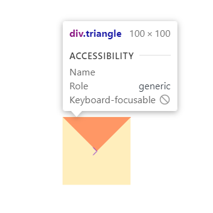
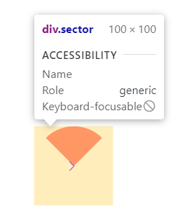

使用 css 绘制一个扇形之前，我们先用 css 绘制一个三角形。
其原理是盒子的 `border` 的每一条边都是一个三角形，利用这个原理
我们只需要将盒子的宽度和高度设置为 0。同时，只设置其中一个 `border`
另外几个 `border` 都设置为 `transparent` 就可以实现一个三角形。

```html
<style>
  .box {
    display: flex;
    justify-content: center;
    align-items: center;
    width: 500px;
    height: 500px;
  }

  .triangle {
    width: 0;
    height: 0;
    font-size: 0;
    border: 50px solid transparent;
    border-top: 50px solid red;
  }
</style>
<div class="box">
  <div class="triangle"></div>
</div>
```

<div style="text-align: center;"></div>

**注意事项**：如果不设置所有的 `border` 的话，不会出现想要的结果。

有了这个功能，我们只需在三角形的基础上，加上 `border-radius` 即可实现一个扇形。

```html
<style>
  .box {
    display: flex;
    justify-content: center;
    align-items: center;
    width: 500px;
    height: 500px;
  }

  .triangle {
    width: 0;
    height: 0;
    font-size: 0;
    border: 50px solid transparent;
    border-top: 50px solid red;
    border-radius: 50%;
  }
</style>
<div class="box">
  <div class="sector"></div>
</div>
```

<div style="text-align: center;"></div>
