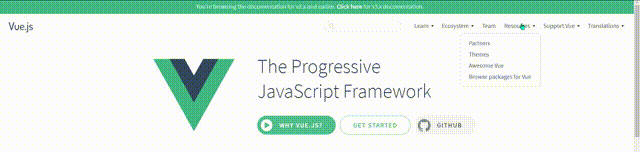
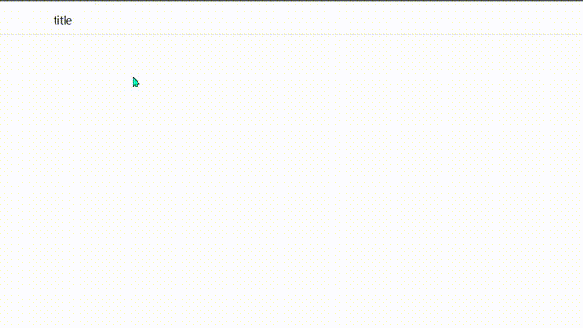
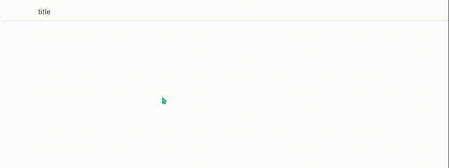

## 问题描述

在实现水平 `Menu` 下拉显示的时候，为了美观 `SubMenu`
与 `Item` 偏移了几个像素，本来想实现如下的效果（外站截取至 Vue 官

<div style="text-align: center;"></div>

但实际做出来的效果如下：

<div style="text-align: center;"></div>

造成这种问题的主要原因是我们在 `title` 和 `list` 之间存在间隙，
下面列出设计到的 `css` 代码：

```css{4}
.sub-menu .sub-menu-list {
  position: absolute;
  left: 0;
  top: calc(100% + 20px);
  padding: 20px;
  border: 2px solid rgba(0, 0, 0, 0.15);
  box-shadow: 0 2px 4px 0 rgba(0, 0, 0, 0.12);
  visibility: hidden;
}
```

## 解决方案

1. 取消 `title` 和 `list` 之间的间隙。但是这样实现后的页面不美观。
2. 添加动画。
3. 添加伪元素。

由于我们采用的是 `visibility` 实现元素的显示和隐藏，所以可以直接使用动画。

增加 `0.2s` 的时间允许用户又充分的时间将鼠标 `hover` 到 `list` 上。

```css{9}
.sub-menu .sub-menu-list {
  position: absolute;
  left: 0;
  top: calc(100% + 20px);
  padding: 20px;
  border: 2px solid rgba(0, 0, 0, 0.15);
  box-shadow: 0 2px 4px 0 rgba(0, 0, 0, 0.12);
  visibility: hidden;
  transition: all 0.2s;
}
```

但是，如果我们采用 `display: none/block;` 来实现元素的消失或隐藏的话，这种方法就行不通。因为动画对 `display` 不起作用。

这就需要用到伪元素了，具体做法如下：

```css{3,8}
.sub-menu-list::before {
  position: absolute;
  top: -25px;
  left: 0;
  display: block;
  content: '';
  width: 100%;
  height: 25px;
  background-color: transparent;
  z-index: inherit;
}
```

我们只需要在 `list` 上添加一个 `before` 的伪元素，
并且让它的 `background-color: transparent;` 用于填充
`title` 和 `list` 之间的空白。

**需要注意的是**伪元素的 `top` 和 `height` 的绝对大小最好保持
一致，同时最好比 `title` 和 `list` 之间的空隙要稍微大一点。

效果如下：

<div style="text-align: center;"></div>

## Appendix

### 最终代码

```html
<!DOCTYPE html>
<html lang="en">
  <head>
    <meta charset="UTF-8" />
    <meta http-equiv="X-UA-Compatible" content="IE=edge" />
    <meta name="viewport" content="width=device-width, initial-scale=1.0" />
    <title>menu</title>
    <style>
      * {
        box-sizing: border-box;
      }
      ul,
      li {
        list-style: none;
        padding: 0;
        margin: 0;
      }

      .menu {
        display: flex;
        flex-wrap: nowrap;
        border-bottom: 1px solid rgba(0, 0, 0, 0.15);
        padding: 10px 0;
      }
      .menu-item {
        cursor: pointer;
      }

      .sub-menu {
        position: relative;
        display: flex;
        justify-content: center;
        width: 200px;
      }

      .sub-menu .sub-menu-title {
        display: flex;
        justify-content: center;
        width: 100%;
        cursor: pointer;
      }

      .sub-menu:hover .sub-menu-list {
        /* visibility: visible; */
        display: block;
      }

      .sub-menu-list::before {
        position: absolute;
        top: -25px;
        left: 0;
        display: block;
        content: '';
        width: 100%;
        height: 25px;
        background-color: transparent;
        z-index: inherit;
      }
      .sub-menu .sub-menu-list {
        position: absolute;
        left: 0;
        top: calc(100% + 20px);
        padding: 20px;
        border: 2px solid rgba(0, 0, 0, 0.15);
        box-shadow: 0 2px 4px 0 rgba(0, 0, 0, 0.12);
        /* visibility: hidden; */
        display: none;
        transition: all 0.2s;
      }
    </style>
  </head>
  <body>
    <div class="menu">
      <div class="sub-menu">
        <div class="sub-menu-title">title</div>
        <ul class="sub-menu-list">
          <li class="menu-item">sub-menu item1</li>
          <li class="menu-item">sub-menu item2</li>
          <li class="menu-item">sub-menu item3</li>
        </ul>
      </div>
    </div>
  </body>
</html>
```
