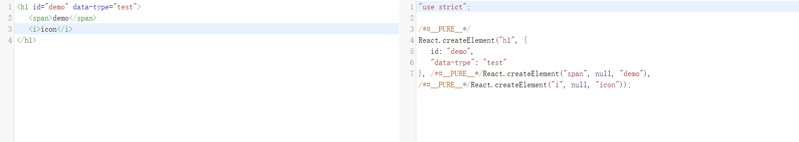
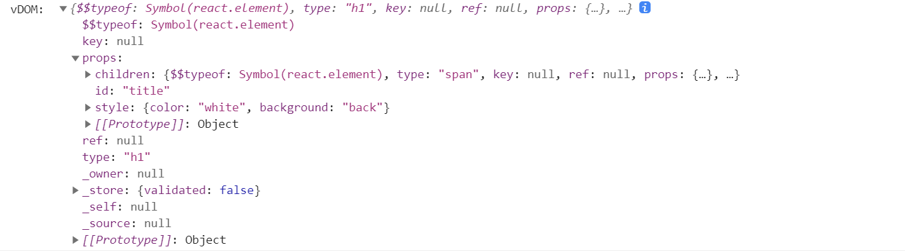

## 对于 React 的理解

1. React 是一个用于构建用户界面的 javascript 库。
2. React 的核心工作原理。

   - 声明式。
   - 组件化。
   - 一次学习，随处编写。

## React 的优缺点

1. 优点。
   - 一次学习，随处编写。
   - API 简洁。
2. 缺点。
   - 没有官方的解决方案，选型成本高。
   - 过域灵活，不容易写出高质量的应用。

## React 为什么要引入 JSX

1. 什么是 JSX

   - JSX 是对 js 的扩展，JSX 可以很好地描述 UI 应该呈现出应有的交互的本质形式。
   - 事实上， JSX 是 `React.createElement` 的一个语法糖。

     

2. 为什么使用 JSX？
   - 采用 JSX 可以很好实现声明式编程。
   - 使代码的结构清晰和简洁，提高代码的可读性。
   - 结构、样式和事件等能够实现高内聚低耦合，方便后续的复用和组合。
   - 不需要引入其他新的语法，会 js 就可以上手 JSX。

## 对于 virtual DOM 的理解

1.  什么是 virtual DOM？

    - 虚拟 DOM 是一个描述真实 DOM 的纯 js 对象。

```javascript
const vDOM = React.createElement(
  'h1',
  { id: 'title', style: { color: 'white', background: 'back' } },
  React.createElement('span', null, 'hello react')
)
console.log('vDOM: ', vDOM)
```



2. virtual DOM 的优点。
   - 处理浏览器的兼容性问题，避免用户直接操作真实 DOM 对象。
   - 内容经过转义处理，可以有效避免 XSS 攻击。
   - virtual DOM 内容与平台无关，可以实现跨平台。
   - 更新的时候可以采用 diff 算法，实现增量更新。

3. virtual DOM 的缺点。
   - 初次渲染的时候并不是很快。
   - 占用内存。

