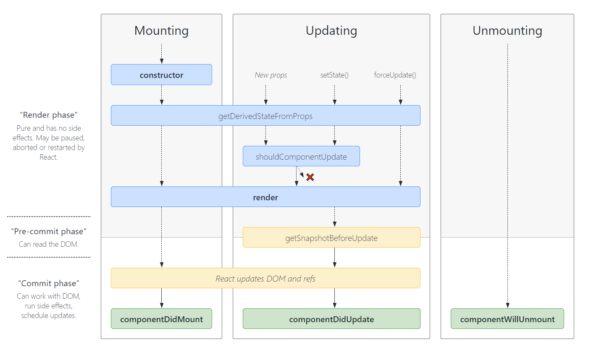
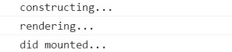
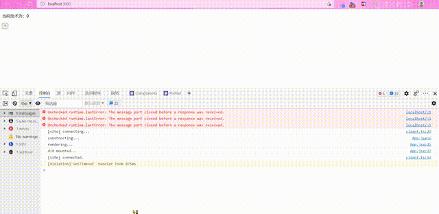
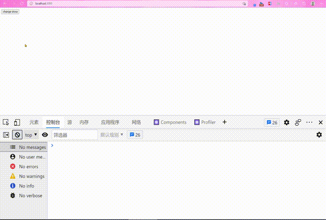
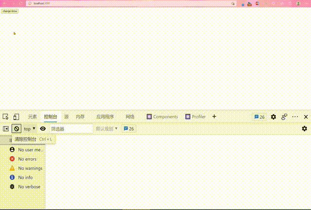

上面是 React 官方提供的 生命周期图示。从图中我们可以看到
React 的生命周期分为三个部分（Mounting, Updating, Unmounting）。

下面我们先搭建我们的测试用例：

```jsx
import React, { Component } from 'react'

export default class App extends Component {
  constructor(props) {
    super(props)
    this.state = {
      count: 0
    }
  }

  setCount = () => {
    this.setState({ count: this.state.count + 1 })
  }

  render() {
    return (
      <div>
        <p>当前技术为：{this.state.count}</p>
        <button onClick={this.setCount}>+</button>
      </div>
    )
  }
}
```

## Mounting

Mounting 阶段执行的是类的构造(constructor)
（如果采用函数组件的话，就没有一个过程）。
然后就是渲染(render) 过程；渲染完成后进行挂载(componentDidMount)

现在我们来验证这个行为，修改我们的测试用例：

```jsx{4,14-16,19}
export default class App extends Component {
  constructor(props) {
    super(props)
    console.log('constructing...')
    this.state = {
      count: 0
    }
  }

  setCount = () => {
    this.setState({ count: this.state.count + 1 })
  }

  componentDidMount() {
    console.log('did mounted...')
  }

  render() {
    console.log('rendering...')
    return (
      <div>
        <p>当前技术为：{this.state.count}</p>
        <button onClick={this.setCount}>+</button>
      </div>
    )
  }
}
```

我们可以从控制台中看到：



## Updating

组件在更新的时候会再次执行渲染（render）函数，渲染完成后
会调用 componentDidUpdate。

下面我们来测试该行为，在上面代码的基础上，我们加上如下几段：

```jsx
  componentDidUpdate() {
    console.log('did updated')
  }
```

可以看到每次我们点击 `+` 使状态发生变化的时候，就会执行
render 和 componentDidUpdate。



## Unmounting

卸载阶段比较简单，React 只会执行 componentWillUnmount。

## 父子组件的生命周期

### Mounting

1. 调用**父组件**的 `constructor` 方法。
2. 调用**父组件**的 `render` 方法。
3. 调用**子组件**的 `constructor` 方法。（这是因为在渲染父组件的时候发现存在子组件需要渲染）
4. 调用**子组件**的 `render` 方法。
5. 调用**子组件**的 `componentDidMount` 方法。（这也很好理解，子组件要先于父组件挂载完成）
6. 调用**父组件**的 `componentDidMount` 方法。

### Updating

1. 调用**父组件**的 `render` 方法。
2. 调用**子组件**的 `render` 方法。
3. 调用**子组件**的 `componentDidUpdate` 方法。
4. 调用**父组件**的 `componentDidUpdate` 方法。

**注意**：如果子组件采用的是 `PureComponent` 的方式，
则更行父组件的状态不会导致子组件更新。

### Unmounting

1. 调用**父组件**的 `componentWillUnmount` 方法。
2. 调用**子组件**的 `componentWillUnmount` 方法。

### 示例

```jsx
// App.jsx
import React, { Component } from 'react'
import Parent from './Parent'

export default class App extends Component {
  state = {
    isShow: true
  }

  setIsShow = () => {
    this.setState({ isShow: !this.state.isShow })
  }

  render() {
    return (
      <div>
        <button onClick={this.setIsShow}>change show</button>
        {this.state.isShow ? <Parent /> : null}
      </div>
    )
  }
}

// Parent.jsx
import React, { Component } from 'react'
import Child from './Child'

export default class Parent extends Component {
  constructor(props) {
    super(props)
    console.log('parent: constructor')
  }

  state = {
    count: 0
  }

  setCount = () => {
    this.setState({ count: this.state.count + 1 })
  }

  componentDidMount() {
    console.log('parent: did mount')
  }

  componentDidUpdate() {
    console.log('parent: did update')
  }

  componentWillUnmount() {
    console.log('parent: will Unmount')
  }

  render() {
    console.log('parent: render')
    return (
      <div>
        <h1>parent</h1>
        <p>parent counter: {this.state.count}</p>
        <button onClick={this.setCount}>parent: +</button>
        <hr />
        <Child />
      </div>
    )
  }
}

// Child.jsx
import React, { Component, PureComponent } from 'react'

export default class Child extends Component {
  constructor(props) {
    super(props)
    console.log('child: constructor')
  }

  state = {
    count: 0
  }

  setCount = () => {
    this.setState({ count: this.state.count + 2 })
  }

  componentDidMount() {
    console.log('child: did mount')
  }

  componentDidUpdate() {
    console.log('child: did update')
  }

  componentWillUnmount() {
    console.log('child: will Unmount')
  }

  render() {
    console.log('child: render')
    return (
      <div>
        <h1>child</h1>
        <p>child counter: {this.state.count}</p>
        <button onClick={this.setCount}>child: +</button>
      </div>
    )
  }
}
```

来看输出的结果：

**未改变状态**时生命周期函数的调用



**改变状态**时生命周期函数的调用



**使用纯组件**时生命周期函数的调用（需要将子组件的继承方式改为 `PureComponent`）


## 纯组件的原理

React 中的 `PureComponent` 继承于 `Component`，只是修改
了 `shouldComponentUpdate` 方法。对 `props`于 `nextProps` 和 `state` 于 `nextState` 进行 浅比较来控制组件是否更新。

下面是 `PureComponent` 的源码：

```javascript
export default function PureComponent(props, context) {
  Component.call(this, props, context)
}

PureComponent.prototype = Object.create(Component.prototype)
PureComponent.prototype.constructor = PureComponent
PureComponent.prototype.shouldComponentUpdate = shallowCompare

function shallowCompare(nexProps, nextState) {
  return (
    !shallowEqual(this.props, nextProps) || !shollowEqual(this.state, nextState)
  )
}

// shollowEqual
export default function shallEqual(objA, objB) {
  // 从后面代码可以看出，对于两个对象的比较为这里的代码
  if (objA === objB) {
    return true
  }

  if (
    typeof objA !== 'object' ||
    objA === null ||
    typeof objB !== 'object' ||
    objB === null
  ) {
    return false
  }

  const keysA = Object.keys(objA)
  const keysB = Object.keys(objB)

  if (keysA.length !== keysB.length) {
    return false
  }

  // Test for A's keys different from B.
  for (let i = 0; i < keysA.length; i++) {
    if (!objB.hasOwnProperty(keysA[i]) || objA[keysA[i]] !== objB[keysA[i]]) {
      return false
    }
  }

  return true
}
```

## Reference

- [React 性能优化：PureComponent 的使用原则](https://segmentfault.com/a/1190000018641319)
