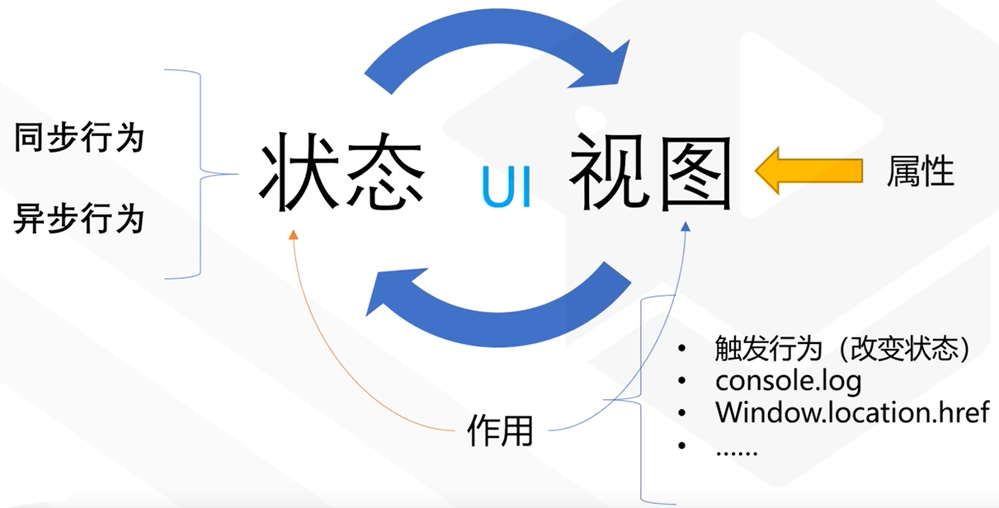

本文是对[【2020 新课程】React Hooks 实战指南](https://www.bilibili.com/video/BV1Ge411W7Ra/?spm_id_from=333.788.recommend_more_video.1) 进行的总结。

## 前置知识

### 什么是 UI ?

我们可以把 UI 看成是这样的一个函数：$UI = f(data)$。

也就是说，函数（$f$） 将 数据（$data$）映射到用户界面（$UI$）上。

例如：[商品 1， 商品 2，商品 3，...] -> 商品列表。

我们可以在前端的主流框架中看到这样的案例。随着 React hooks 的推出，我们能否对 UI 做进一步的思考呢。

随着对 React hooks 的学习，我们将继续探讨这个问题。

### 状态（state）是数据吗？

事实上，状态存在一个隐含的关系是**存在改变状态的行为**。

例如：点赞数（likes - 状态）\*\*隐含了增加一个赞（addLike-行为）。二这个点赞的行为只有在特定的上下文（context）环境下才存在。

如果只有点赞数，没有点赞的行为，我们只能将其称之为数据，而不是状态。

## Hooks

### 什么是 Hooks？

简单来说，Hooks 是 React16.8 推出的新特性，用于加强函数式组件
的功能。

### 从描述 UI 再到 Hooks


我们可以认为 UI 是从数据开始，通过数据驱动视图。视图并不是 UI，
视图的死的，但是用户可以通过视图提供的事件来驱动数据的更新，
从而更新视图。

视图所提供的事件我们可以称做消息，触发消息可以触发重算的机制，最终
重算数据，而数据的修改又驱动了视图。

从上面的描述我们可以了解到，从数据到视图是单向流动的，也就是**单项数据流**。
这是目前主流的框架所采用的 MVVM 模型。

我们可以深入思考：消息和重算事实上是数据和视图之间的行为，那么我们完全
可以把消息和重算合并为行为。所以上面的模型可以归结为如下图：


行为又能划分为**同步行为**和**异步行为**。


通过前面的讲解，事实上，我们也可以将数据进行拆分。
我们可以把不变的数据称为**属性**，把随着行为发生改变的数据称为**状态**。


前面我们也说了，行为是状态的映射，所我们可以将行为和状态进行合并。所以我们又可以将上面的图进行简化。


上面我们一步步将 UI 模型进行简化为状态和视图，但是关有状态和视图的行不通的，我们还需要作用。

为什么需要作用呢？例如：用户可以 `console.log` 或者通过 `window.location.href` 进行跳转。
这些显然不在我们 UI 的描述范围内，但是又有可能会修改我们的状态，我们把这类行为称作作用。
于是乎，我们上面的模型又可以进一步抽象：



落实到程序中，我们当然可以把状态和作用都放在视图里面，但是这样做会导致代码的复用性很差，为了使
我们降低程序的耦合性，我们可以将形形色色的概念与视图关联起来，而不是直接放在视图里面。我们在
这种关联的关系称之为**Hooks**。


### 三个基础的 Hooks：`useState`, `useEffect`, `useContext`

#### useState

我们上提及到有一类行为，我们将其抽象成状态。
`useState` 帮助我们将数据和行为进行绑定，也就是我们前面说的**状态**。
我们可以把 `useState` 描述为**在某个上下文中**（用户界面）的数据和改变数据的行为。

以计数器为例：

```typescript
const UseStateExample1 = () => {
  //*    状态,   行为        API
  const [count, setCount] = useState(0)
  return (
    <div>
      <h2>useState</h2>
      <p>count: {count}</p>
      <button onClick={() => setCount((count) => count + 1)}>increment</button>
    </div>
  )
}
```

除了直接使用提供的 Hooks，React 还允许我们自定义 Hooks。我们将采用我们自定义的 hook，
来描述我们上面的行为。

```tsx
const useCount = () => {
  const [count, setCount] = useState(0)
  const addOne = () => setCount(count + 1)
  return [count, addOne]
}

export const UseStateExample2 = () => {
  //*    状态,   行为        API
  const [count, addOne] = useCount()
  return (
    <div>
      <h2>useState</h2>
      <p>count: {count}</p>
      <button onClick={addOne as any}>increment</button>
    </div>
  )
}
```

（**Note**：React 规定了 Hooks 只能在 React 组件或者其他 Hooks 中使用，
为了让 eslint 能够在编译前就检测出来，React 规定自定义的 Hooks 都需要以
use 开头进行命名。）

有了 Hooks，我们就能更好地进行代码的复用。例如：我们现在有两个 `count`，如果
使用类组件，我们需要这样做：

```tsx
class Example extends React.Component {
  state = {
    count1: 0,
    count2: 0
  }

  setCount1 = () => this.setState({ count1: this.state.count1 + 1 })
  setCount2 = () => this.setState({ count2: this.state.count2 + 1 })
}
```

显然，业务逻辑相同，但我们不得不再写一次代码。而使用 React Hooks 我们可以轻松实现这一点：

```tsx
export const UseStateExample3 = () => {
  //*    状态,   行为        API
  const [count1, setCount1] = useState(0)
  const [count2, setCount2] = useState(0)
  return (
    <div>
      <h2>useState</h2>
      <p>count1: {count1}</p>
      <p>count2: {count2}</p>
      <button onClick={() => setCount1((count1) => count1 + 1)}>
        increment count1
      </button>
      <button onClick={() => setCount2((count2) => count2 + 1)}>
        increment count2
      </button>
    </div>
  )
}
```

从上述的例子我们可以对状态有进一步的认识：我们把具有行为的数据看成是状态，
那么状态就应该与其相应的行为封装在一起，这才是 React 中 `useState` 的
设计理念。

#### useEffect

effect 可以翻译为作用。作用可以认为是 UI 将数据映射到视图之外的东西，可以认为是函数。
作用是我们不可以感知但却确确实实存在的。

考虑下面的例子：

```tsx
export const UseEffectExample1 = () => {
  const [count, setCount] = useState(0)
  useEffect(() => {
    console.log('current count: ', count)
  })

  return (
    <div>
      <p>count: {count}</p>
      <button onClick={() => setCount((count) => count + 1)}>increment</button>
    </div>
  )
}
```

我们通过 `useEffect` 产生一个作用，React 会帮我们在状态发生改变的时候生成这个作用，也就是
在控制台输出一段话。我们把这个行为发生变化而产生作用的状态称作**依赖**。在 `useEffect` 中
如果不主动传入依赖的话，默认依赖是所有状态，也就是只有当前组件状态发生变化就会执行 `useEffect`
中的回调代码。

我们也可以手动地传入依赖，如下面所示：

```tsx
export const UseEffectExample2 = () => {
  const [count, setCount] = useState(0)
  const [other, setOther] = useState(0)

  // 依赖 count 产生的作用
  useEffect(() => {
    console.log('current count: ', count)
  }, [count])

  return (
    <div>
      <p>count: {count}</p>
      <button onClick={() => setCount((count) => count + 1)}>increment</button>
      <p>other: {other}</p>
      <button onClick={() => setOther((other) => other + 1)}>update</button>
    </div>
  )
}
```

我们完全可以认为这个作用是依赖 `count` 产生的。值得注意的是，在函数环境下 `useEffect` 中的
函数采用的是快照值，考虑下面的例子。

```tsx
export const UseEffectExample3 = () => {
  const [count, setCount] = useState(0)
  useEffect(() => {
    setInterval(() => console.log('count: ', count), 1000)
  }, [])

  return (
    <div>
      <p>count: {count}</p>
      <button onClick={() => setCount((count) => count + 1)}>increment</button>
    </div>
  )
}
```

我们使用 `useEffect` 产生一个不依赖任何状态作用，我们可能会认为控制台会输出 0, 1, 2, 3, ... 但事实是，
控制台只输出 0，这是在闭包的环境下，`useEffect` 只会调用（产生）一次函数，而该函数只能使用到 `count`
的快照值，所以只会输出 0。

这也给我们提了一个醒，如果产生作用的函数需要依赖其他状态的话，最好把该状态放在 `useEffect` 的依赖中。
这就是为什么如果不传入依赖 eslint 会提醒我们要传入依赖。

从上面的例子我们可以看到 React 给我们提供一个产生作用的 hooks，但是我们如何取消这个作用带来的副作用呢？
例如我们上面的例子，在 `useEffect` 中产生了一个定时器，那么如何在组件中取消定时器呢？

其实，我们如果在产生作用函数中返回一个函数，就可以取消该作用。

```tsx
const useInterval = (cb: (...args: any[]) => any, time: number) => {
  useEffect(() => {
    const i = setInterval(cb, time)
    return () => {
      clearInterval(i)
    }
  }, [])
}
```

#### useContext

context 上下文可以认为是背景知识，大家所认知的事物。在 React
中在同一个上下文的环境下，子组件拥有共同的认知。在 `useContext` 出来之前，
React 创建和使用 context 是比较麻烦的，很容易就出现多层嵌套的关系，使用 `useContext`
就可以避免这种嵌套的关系。

在 UI 产生的过程中，可以从 context 中获取数据（知识），从而使 UI 更像个人而不是机器。

考虑下面的例子：

```tsx
const themes = {
  light: {
    foreground: '#000',
    background: '#eee'
  },
  dark: {
    foreground: '#fff',
    background: '#222'
  }
}

const ThemeContext = createContext({
  theme: themes.light,
  toggle: () => {}
})
```

我们先创建一个上下文，用于存储主题相关的共同数据（知识），同时提供一个改变主题颜色的回调方法。
然后我们在组件中使用这个知识：

```tsx
const ToolBar = () => {
  const context = useContext(ThemeContext)
  return (
    <div>
      <button onClick={context.toggle}>change theme</button>
    </div>
  )
}

const UseContextExample1 = () => {
  const [theme, setTheme] = useState(themes.light)
  return (
    <ThemeContext.Provider
      value={{
        theme,
        toggle: () => {
          setTheme((theme) => {
            return theme === themes.light ? themes.dark : themes.light
          })
        }
      }}
    >
      <div
        className="container"
        style={{ background: theme.background, color: theme.foreground }}
      >
        <span>container</span>
        <ToolBar />
      </div>
    </ThemeContext.Provider>
  )
}
```

我们先看 `UseContextExample1`，里面我们用 `ThemeContext.Provider` 为后续的子组件
提供主题相关的上下文，这样子组件就可以直接使用主题上下文而不需要在父组件中层层传递了。

而且，这个上下文子组件是选择性使用了，也就是说这是大家共同的知识，但我不一定要使用它。

### 进阶 Hooks

#### `useReducer`

Reducer 可以理解为减压器减少器，但是在前端我们可以理解它是一种设计模式，提供一种抽象状态
行为的封装，以及计算过程的抽象方案。


下面我们使用计数器作为例子，介绍一下 `useReducer` 的基本使用。

```tsx
import { useReducer, useState } from 'react'

interface IState {
  count: number
}
interface IAction {
  type: 'increment' | 'decrement'
  step: number
}

const initialState = {
  count: 0
}

const reducer = (state: IState, action: IAction) => {
  const { type, step } = action
  const { count } = state
  switch (type) {
    case 'increment':
      return { ...state, count: count + step }
    case 'decrement':
      return { ...state, count: count - step }
    default:
      return initialState
  }
}

const UseReducerExample1 = () => {
  const [state, dispatch] = useReducer(reducer, initialState)
  const [inputValue, setInputValue] = useState(0)
  const { count } = state

  const handleClick = (type: IAction['type']) => {
    dispatch({ type, step: inputValue })
  }

  return (
    <div>
      <input
        type="number"
        value={inputValue}
        onChange={(e) => {
          setInputValue(parseFloat(e.target.value || '0'))
        }}
      />
      <p>count: {count}</p>
      <button onClick={() => handleClick('increment')}>+</button>
      <button onClick={() => handleClick('decrement')}>-</button>
    </div>
  )
}
```

`useReducer` 的主要用法是 `const [state, dispatch] = useReducer(reducer, initialState)`，
其他部分跟 redux 基本一致。

有了 Hooks，我们还可以对上面的代码进行进一步的封装。

```tsx
const useCounter = () => {
  const [state, dispatch] = useReducer(reducer, initialState)
  const [inputValue, _setInputValue] = useState(0)
  const { count } = state
  const setInputValue = (value: string) => {
    _setInputValue(parseFloat(value || '0'))
  }

  return {
    count,
    inputValue,
    setInputValue,
    dispatch
  }
}

const UseReducerExample2 = () => {
  const { count, inputValue, setInputValue, dispatch } = useCounter()

  const handleClick = (type: IAction['type']) => {
    dispatch({ type, step: inputValue })
  }

  return (
    <div>
      <input
        type="number"
        value={inputValue}
        onChange={(e) => {
          setInputValue(e.target.value)
        }}
      />
      <p>count: {count}</p>
      <button onClick={() => handleClick('increment')}>+</button>
      <button onClick={() => handleClick('decrement')}>-</button>
    </div>
  )
}
```

代码和上面的基本一致，只是我们通过自定义 Hooks 进一步的封装，使业务代码与 UI
部分的代码进行抽离。

#### `useRef`

使用 `useRef` 可以引用 React 管理以外的对象。虽然 React 帮我们管理很多事情，
但是有些内容 React 还是不能帮我们管理到的，例如：使某个个 DOM 元素 `focus` 的事件，媒体对象操作等。
当我们要触发一个输入框的 focus 事件时，我们就不得不先获取到这个输入框，但是 React 并没有为我们提供
这个操作，所以我们得自己手动去获取输入框。

`useRef` 通常会伴随着 `useEffect`。还有一点就是，`useRef` 还可以用来保存值。

下面演示一下使用 `useEffect` 获取 DOM 元素的引用。

```tsx
const UseRefExample1 = () => {
  const inputRef = useRef<HTMLInputElement>(null)
  return (
    <div>
      <input type="text" ref={inputRef} />
      <button
        onClick={() => {
          inputRef.current!.focus()
        }}
      >
        focus
      </button>
    </div>
  )
}
```

来看我们之前使用 `useEffect` 出现的问题：

```tsx
const UseRefExample2 = () => {
  const [count, setCount] = useState(0)
  useEffect(() => {
    const i = setInterval(() => {
      console.log('current count: ', count)
    }, 1000)
    return () => {
      clearInterval(i)
    }
  }, [])
  return (
    <div>
      <p>count: {count} </p>
      <button onClick={() => setCount((count) => count + 1)}>+</button>
    </div>
  )
}
```

在控制台只会输出 `0`。现在我们使用 `useRef` 进行修复。

```tsx
const UseRefExample2 = () => {
  const [count, setCount] = useState(0)
  const countRef = useRef<number | null>(null)

  useEffect(() => {
    const i = setInterval(() => {
      console.log('current count: ', countRef.current)
    }, 1000)
    return () => {
      clearInterval(i)
    }
  }, [countRef])
  return (
    <div>
      <p>count: {count} </p>
      <button
        onClick={() => {
          setCount((count) => {
            const result = count + 1
            countRef.current = result
            return result
          })
        }}
      >
        +
      </button>
    </div>
  )
}
```

由于我们使用的是引用值，所以定时器中可以拿到最新的值。

#### 缓存

为了提供性能，我们在某些场景会使用到缓存进行优化，React 为我们提供两个
缓存的 Hooks： `useCallback` 和 `useMemo`

`useCallback` 用于缓存函数，而 `useMemo` 用于缓存值。

##### `useCallback`

在函数环境下，我们在 render 函数中定义内部函数时，每次执行 `render` 都会
重新创建一个函数，显然这样是非常消耗性能的。这种情况下我们就可以使用 `useCallback`
对函数进行缓存了。

考虑下面的例子：

```tsx
const set = new Set()
const UseCallbackExample1 = () => {
  const [count, setCount] = useState(1)
  const handleClick = () => {
    setCount((count) => count + 1)
  }
  set.add(handleClick)

  return (
    <div>
      <p>count: {count}</p>
      <p>set.size: {set.size}</p>
      <button onClick={handleClick}>+</button>
    </div>
  )
}
```


可以看到，我们每次修改 `count` 触发 `render` 函数时，
内部就会创建 `handleClick` 函数。为了优化代码，我们可以采取如下的方式：

```tsx
const UseCallbackExample2 = () => {
  const [count, setCount] = useState(1)
  // const handleClick = () => {
  //   setCount((count) => count + 1)
  // }
  const handleClick = useCallback(() => {
    setCount((count) => count + 1)
  }, [setCount])
  set.add(handleClick)

  return (
    <div>
      <p>count: {count}</p>
      <p>set.size: {set.size}</p>
      <button onClick={handleClick}>+</button>
    </div>
  )
}
```

从输出的结果看，使用 `useCallback` 后 `handleClick` 只会调用一次。


##### `useMemo`

使用 `useMemo` 实现记录修改时间的功能。

```tsx
const UseMemoExample1 = () => {
  const [count1, setCount1] = useState(0)
  const [count2, setCount2] = useState(0)
  const date = useMemo(() => {
    console.log('call useMemo callback. count1 = ', count1)
    return Date.now()
  }, [count1])
  return (
    <div>
      <p>count: {count1} </p>
      <p>count: {count2} </p>
      <p>last count1 modified timestamp: {date}</p>
      <button onClick={() => setCount1((count) => count + 1)}>count1++</button>
      <button onClick={() => setCount2((count) => count + 1)}>count2++</button>
    </div>
  )
}
```

从控制台我们可以看到：当 `count1` 发生改变的时候，控制台会输出相应的消息，同时页面中的 `last count1 modifies timestamp` 也会随之改变。而 `count2` 发生改变时则不会执行内部代码。

主要原因如下：

1. React 帮我们对执行的结果进行缓存。
2. 指定了依赖，当依赖发生改变的时候就会重新执行回调函数。

事实上，`useMemo` 和 Vue 中的计算属性差不多。

## Hooks 使用建议

1. 使用 `useMemo` 避免重绘问题。
2. 注意 hooks 同步问题。
3. 使用自定义的 hook 封装行为。
```tsx
const Tip1 = () => {
  const [count, setCount] = useState(0)

  const fn = () => {
    const i = setInterval(() => {
      console.log('count: ', count)
      setCount(count + 1)
    }, 1000)
    return () => {
      clearInterval(i)
    }
  }

  useEffect(fn, [])
  return (
    <div>
      <p>count: {count}</p>
      <button onClick={() => setCount((count) => count + 1)}>+</button>
    </div>
  )
}
```
4. 每种行为都应该有各自的 hook。
5. 不要思考生命周期。

## Reference

[【2020 新课程】React Hooks 实战指南](https://www.bilibili.com/video/BV1Ge411W7Ra)
