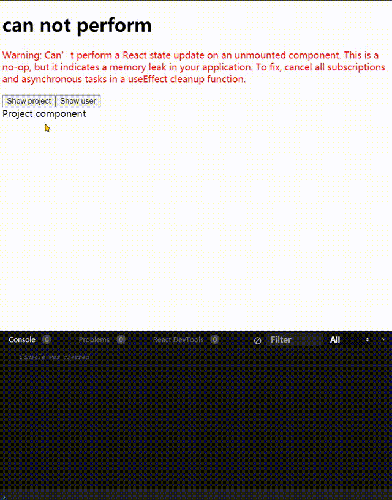
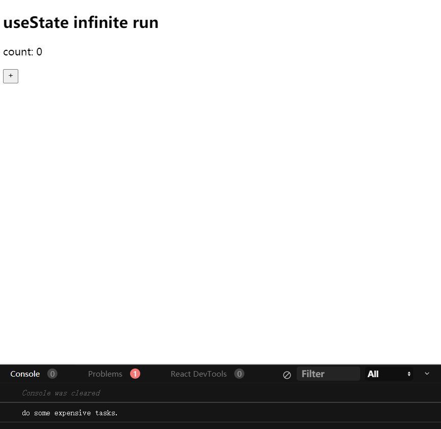
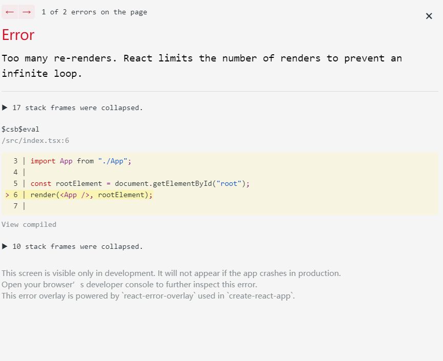

## Can’t perform a React state...

### 问题描述

在学习 [React17+React Hook+TS4 最佳实践仿 Jira 企业级项目](https://coding.imooc.com/class/482.html?mc_marking=9e12a70b0fad334358274d727c6587c6&mc_channel=weixin) 中遇到一个警告：

<p style="color: red;">Warning: Can’t perform a React state update on an unmounted component. This is a no-op, but it indicates a memory leak in your application. To fix, cancel all subscriptions and asynchronous tasks in a useEffect cleanup function.</p>

显然，这是因为在组件卸载的时候，继续使用了 `setState` 方法，可能会导致内存泄露。

但是，项目开发在一半，项目的复杂性已经上来了，而且控制台的提示太模棱两可了，
bug 非常难以定位。

从其他开发者的博客中可以了解到，该问题是在组件卸载的时候，`setState` 可能会执行导致内存泄漏。
主要原因如下：

1. 在 `setTimeout` 使用了 setState，但却没有在组件卸载之前清楚定时器。
2. 在 `Promise.then` 中使用了 `setState`后，没有及时清理副作用，等到下一轮任务来临时，
   React 组件可能已经被卸载了。

### 问题重现

```tsx
import { useEffect, useState } from 'react'

const User = () => {
  const [user, setUser] = useState<{ id: number; name: string } | null>(null)

  useEffect(() => {
    setTimeout(() => {
      // The warning is generated by this code
      // If the component unmounts faster than 3s
      setUser({
        id: 1,
        name: 'John',
      })
    }, 3000)
  }, [])

  return <div>{user?.name || 'No user found'}</div>
}
const Project = () => <div>Project component</div>

const CanNotPerformExample1 = () => {
  const [activeView, setActiveView] = useState('project')

  const toggleUser = () => {
    setActiveView('user')
  }

  const toggleProject = () => {
    setActiveView('project')
  }
  return (
    <div>
      <button onClick={toggleProject}>Show project</button>
      <button onClick={toggleUser}>Show user</button>
      {activeView === 'user' ? <User /> : <Project />}
    </div>
  )
}

export const CanNotPerformExample = () => {
  return (
    <div>
      <div className='desc'>
        <h1>can not perform</h1>
        <p style={{ color: 'red' }}>
          Warning: Can’t perform a React state update on an unmounted
          component. This is a no-op, but it indicates a memory leak in your
          application. To fix, cancel all subscriptions and asynchronous tasks
          in a useEffect cleanup function.
        </p>
      </div>
      <div className='examples'>
        <CanNotPerformExample1 />
      </div>
    </div>
  )
}
```



在这个案例中，之所以会出现这个问题，是因为我们在切换组件的时候，`setTimeout` 中的代码还没
执行，当 `<User />` 组件卸载的时候，`setTimeout` 中的代码才开始执行，然而 `state` 已经
被回收了，所以会导致内存泄漏。

### 问题解决

#### 方案一：使用 `useEffect` cleanup

`useEffect` 为我们提供了 cleanup 的功能，只需要在 `useEffect`
的回调中返回一个 cleanup 函数即可。

```tsx
const User = () => {
  const [user, setUser] = useState<{ id: number; name: string } | null>(null)

  useEfnect(() => {
    const timer = setTimeout(() => {
      // The warning is generated by this code
      // If the component unmounts faster than 3s
      setUser({
        id: 1,
        name: 'John'
      })
    }, 3000)
    return () => {
      clearTimeout(timer)
    }
  }, [])
```

#### 方案二：使用一个标识位

事实上，除了 `setTimeout` 这类定时器会触发这个警告之外，像 `Promise.then` 这类微任务也可能
触发这个警告。`Promise` 一旦承若就会执行，所以我们需要一个标识位来避免执行。

```tsx
//* Solution2
useEffect(() => {
  let isMounted = true
  setTimeout(() => {
    // The warning is generated by this code
    // If the component unmounts faster than 3s
    if (isMounted) {
      setUser({
        id: 1,
        name: 'John',
      })
    }
  }, 3000)
  return () => {
    isMounted = false
  }
}, [])
```

### 实际开发中的问题

```tsx
import { useCallback, useState } from 'react'

export interface IState<D> {
  stat: 'idle' | 'loading' | 'error' | 'success'
  data: D | null
  error: Error | null
}

const defaultState: IState<null> = {
  stat: 'idle',
  data: null,
  error: null,
}

const defaultConfig = {
  throwOnError: false,
}

const useAsync = <D>(
  initialState?: IState<D>,
  initialConfig?: typeof defaultConfig,
) => {
  initialConfig = {
    ...defaultConfig,
    ...initialConfig,
  }
  const [state, setState] = useState<IState<D>>({
    ...defaultState,
    ...initialState,
  })
  const [retry, setRetry] = useState(() => () => {})

  const setError = useCallback((error: Error) => {
    setState({
      data: null,
      stat: 'error',
      error,
    })
  }, [])

  const setData = useCallback((data: D) => {
    setState({
      data,
      error: null,
      stat: 'success',
    })
    // return data
  }, [])

  const run = useCallback(
    (promise: Promise<D>, runConfig?: { retry: () => Promise<D> }) => {
      if (!promise || !promise.then) {
        throw new Error(`${promise} should be a Promise type.`)
      }
      setState(prevState => ({ ...prevState, stat: 'loading' }))
      setRetry(() => () => {
        if (runConfig?.retry) {
          run(runConfig.retry(), runConfig)
        }
      })
      return promise
        .then(data => {
          setData(data)
          return data
        })
        .catch(e => {
          setError(e)
          return initialConfig?.throwOnError ? Promise.reject(e) : e
          // return Promise.reject(e)
        })
    },
    [isMountedRef, initialConfig.throwOnError, setData, setError],
  )

  return {
    isLoading: state.stat === 'loading',
    isIdle: state.stat === 'idle',
    isError: state.stat === 'error',
    isSuccess: state.stat === 'success',
    setData,
    setError,
    run,
    retry,
    ...state,
  }
}

export default useAsync
```

在自定义 `useAsync` hook 的时候就遇到在这种问题，主要原因还是在 `Promise.then` 和 `Promise.catch`
中使用了 `setState` 方法。

解决方法：这里需要 `useEffect` 的 cleanup 函数在组件卸载的时候执行清理操作。

1. 使用 `useRef` 缓存一个标识位。
2. 执行 cleanup 函数的时候，重置标识位即可。
3. 在使用 `setState` 的时候，先判断是否满足要求，再决定 `setState`。

```tsx
const useMountedRef = () => {
  const isMountedRef = useRef(false)
  useEffect(() => {
    isMountedRef.current = true
    return () => {
      isMountedRef.current = false
    }
  }, [])
  return isMountedRef
}

const useAsync = <D>(
  initialState?: IState<D>,
  initialConfig?: typeof defaultConfig,
) => {
  // statements...
  const isMountedRef = useMountedRef()

  const run = useCallback(
    (promise: Promise<D>, runConfig?: { retry: () => Promise<D> }) => {
      if (!promise || !promise.then) {
        throw new Error(`${promise} should be a Promise type.`)
      }
      setState(prevState => ({ ...prevState, stat: 'loading' }))
      setRetry(() => () => {
        if (runConfig?.retry) {
          run(runConfig.retry(), runConfig)
        }
      })
      return promise
        .then(data => {
          isMountedRef.current && setData(data)
          return data
        })
        .catch(e => {
          isMountedRef.current && setError(e)
          return initialConfig?.throwOnError ? Promise.reject(e) : e
          // return Promise.reject(e)
        })
    },
    [isMountedRef, initialConfig.throwOnError, setData, setError],
  )
  // statements...
}
```

### 与 `useReducer` 优雅连用

```tsx{20-28}
interface IState {
  count: number
}
interface IAction {
  type: string
  payload: number
}
const reducer: React.Reducer<IState, IAction> = (state, action) => {
  const { type, payload } = action
  switch (type) {
    case 'increment':
      return { ...state, count: state.count + payload }
    case 'decrement':
      return { ...state, count: state.count - payload }
    default:
      return state
  }
}

const useSafeDispatch = (dispatch: (...args: any[]) => any) => {
  const mountedRef = useMountedRef()
  return useCallback(
    (...args: Parameters<typeof dispatch>) => {
      return mountedRef.current ? dispatch(...args) : void 0
    },
    [dispatch, mountedRef],
  )
}

const CanNotPerformExample2 = () => {
  const [state, dispatch] = useReducer(reducer, { count: 0 })
  const safeDispatch = useSafeDispatch(dispatch)
  return (
    <div>
      <p>count: {state.count}</p>
      <button onClick={() => safeDispatch({ type: 'increment', payload: 1 })}>
        increment
      </button>
      <button onClick={() => safeDispatch({ type: 'decrement', payload: 1 })}>
        decrement
      </button>
    </div>
  )
}
```

核心代码已高亮，主要是利用闭包对 `dispatch` 进行拦截，在执行
`dispatch` 之前，判断是否为 `mounted` 状态，如果不是 `mounted`
就不执行 `dispatch`。

**注意**：`safeDispatch` 需要使用 `useCallback` 进行缓存，这是
为了避免后续使用 react 的 hooks 需要添加依赖时导致无限渲染。

### 小结

在使用 hooks 的时候需要注意 `setState` 的调用时机，
通常可以使用 `useEffect` 来清楚执行过程中产生的副作用。

## `useState` 懒加载

`useState` 为我们提供了惰性初始化的功能，当 `useState` 的第一个参数为
一个函数时，React 就会认为我们使用惰性初始化的操作，会在第一次执行 render
的时候执行该函数，同时把惰性初始化函数的返回值作为 initialState。

考虑下面的例子：

```tsx
import { useState } from 'react'

const doSomeExpensiveTasks = () => {
  console.log('do some expensive tasks.')
}
const UseStateInifiniteRunExample1 = () => {
  const [count, setCount] = useState(() => {
    doSomeExpensiveTasks()
    return 0
  })

  return (
    <div>
      <p>count: {count}</p>
      <button onClick={() => setCount(count => count + 1)}>+</button>
    </div>
  )
}
```



从控制台的输出来看，确实如此。

正因为这样的特性，我们不能直接使用 `useState` 将函数作为 state（这也是
React 设计之初不想看到的，当然我们可以使用惰性函数返回另一个函数来实现）。
如果我们使用 `useState` 将函数作为 `state` 可能会发生意想不到的结果。

考虑下面的例子：

```tsx
const useAsync = () => {
  const [data, setData] = useState<any>(null)
  const [isLoading, setIsLoading] = useState(false)
  const [error, setError] = useState<null | Error>(null)
  const isError = useMemo(() => !!error, [error])
  const [retry, setRetry] = useState(() => {})

  const run = (promise: Promise<any>) => {
    setIsLoading(true)
    setError(null)
    setRetry(() => run(promise))
    return promise
      .then(data => {
        setData(data)
        setIsLoading(false)
      })
      .catch(e => {
        setError(e)
        setIsLoading(false)
      })
  }

  return {
    data,
    run,
    retry,
    isError,
    isLoading,
  }
}

const UseStateInifiniteRunExample2 = () => {
  const { run, retry } = useAsync()
  run(Promise.resolve(1))
  return <div></div>
}
```

我们自定义一个 hook 用于执行异步函数，同时还提供一个 `retry` 重新执行
的功能。执行上面的代码会发现，React 直接抛出一个错误：



这就是我们想用 `useState` 保存函数的错误。由于 `useState` 第一个参数如果是函数的话，React 会帮我们调用该函数。而在 `run` 函数中，我们
`setRetry` 中传入一个函数，执行 `run` 方法，这样就造成递归调用。
为了避免递归调用，我们可以用 `useRef` 来缓存函数。

## `useRef` 缓存函数存在的问题

考虑下面的例子：

```tsx
import React, { useRef, useState } from 'react'

const UseRefExample1 = () => {
  const [_, render] = useState<any>(null)
  const retry = useRef(() => {
    console.log('11111111')
  })

  const handleClick = () => {
    retry.current = () => {
      console.log('222222222')
    }
  }

  return (
    <div>
      <button onClick={retry.current}>invoke retry</button>
      <button onClick={handleClick}>change retry</button>
      <button onClick={render}>invoke render</button>
    </div>
  )
}
```

我们使用 `useRef` 缓存一个函数，然后设计一个 button，当点击的时候我们
就改变 ref 缓存的函数，然而我们再执行的时候，却还是执行一开始的函数。
如下图所示：


这是因为 `useRef` 会产生一个引用，修改 `ref.current` 并不会使
页面更新，所以需要等到下一个 `render` 的时候才会执行新的函数。

## Reference

- [Warning: Can't Perform A React State Update On An Unmounted Component](https://www.vhudyma-blog.eu/warning-cant-perform-a-react-state-update-on-an-unmounted-component/)
