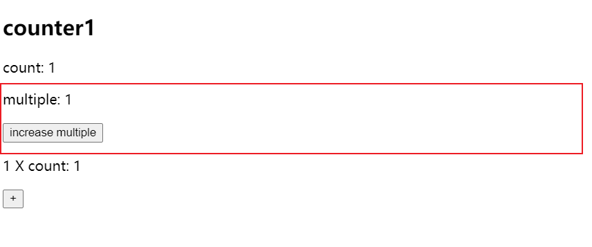

## 组件二次封装

组件的二次封装时，最好做到属性穿透，可以利用 es6 对象展开来实现。

```tsx
// ./Counter.tsx
import React, { useState } from 'react'

export interface ICounterProps {
  onClick?: (count: number) => void
  initialValue?: number
  title?: string
  description?: string
}

export const Counter = ({
  onClick,
  initialValue = 0,
  children,
  title,
  description,
}: React.PropsWithChildren<ICounterProps>) => {
  const [count, setCount] = useState(initialValue)

  const handleClick = () => {
    onClick?.(count + 1)
    setCount(count => count + 1)
  }

  return (
    <div>
      {title ? <h2>{title}</h2> : null}
      {description ? <p>{description}</p> : null}
      <p>count: {count}</p>
      {children}
      <button onClick={handleClick}>+</button>
    </div>
  )
}
```

我们将在上面的计数器上进行封装，封装后的效果如下图：



我们将在原先的 Counter 对当前的 count 乘以 n 倍。

```tsx
import React, { useCallback, useState } from 'react'
import { Counter } from './Counter'

export interface INCounterProps extends React.ComponentProps<typeof Counter> {
  multiple?: number
  initialValue?: number
}

export const NCounter = ({
  multiple = 2,
  initialValue = 1,
  onClick,
  children,
  ...restProps
}: INCounterProps) => {
  const [nCount, setNCount] = useState(initialValue * multiple)

  const handleClick = useCallback(
    count => {
      const nCount = count * multiple
      setNCount(nCount)
      onClick?.(nCount)
    },
    [onClick, multiple],
  )

  return (
    <Counter onClick={handleClick} initialValue={initialValue} {...restProps}>
      {children}
      <p>
        {multiple} X count: {nCount}
      </p>
    </Counter>
  )
}
```

上面最重要的代码是
`<Counter onClick={handleClick} initialValue={initialValue} {...restProps}>` 将属性进行透传。为了让 ts 能够更好发挥作用，还需要借助
`React` 提供的工具类进行类型提取：`export interface INCounterProps extends React.ComponentProps<typeof Counter>`
