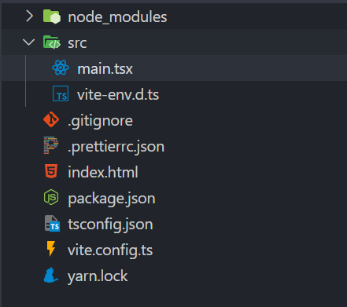
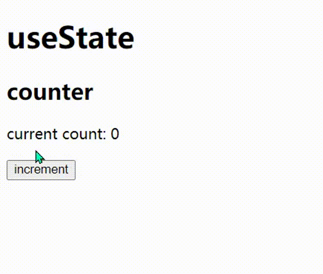
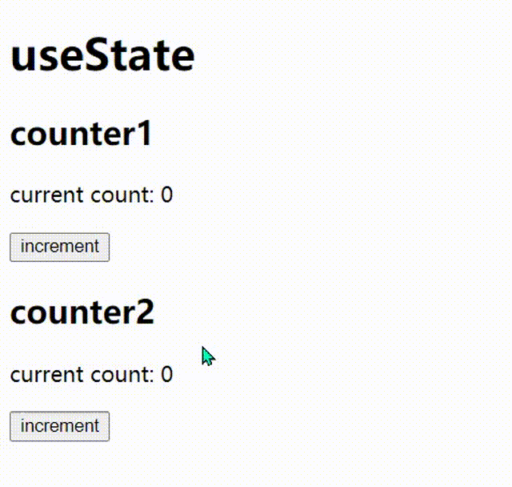
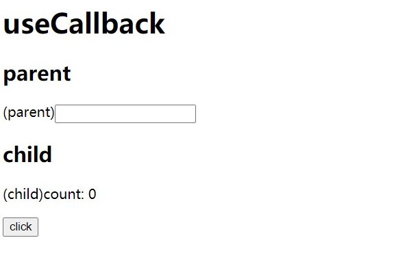
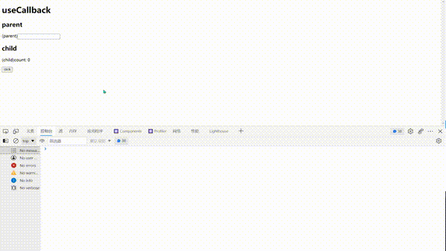
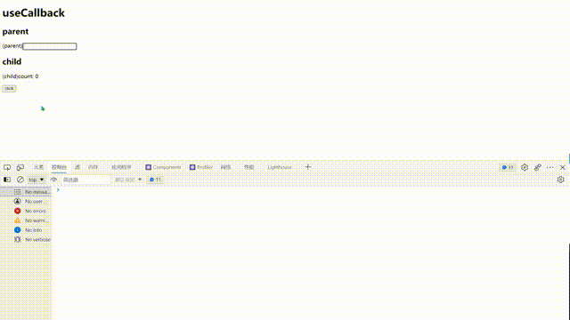

一步步使用 TypeScript 实现实现迷你版 React Hook。

## Prepare

我们使用 `vite` 创建一个 React App。

在命令行中，使用 `yarn create @vitejs/app mini-hooks --template react-ts` 创建一个 React App，完成后，我们将使用 `prettier` 对代码进行简单的格式化，
在终端执行：
`yarn add prettier --exact`

然后创建 `prettier` 的配置文件：

```json
{
  "singleQuote": true,
  "semi": false,
  "trailingComma": "all",
  "quoteProps": "consistent"
}
```

接下来，我们先删除项目中必要的文件，最后保留的文件如下：

<div style="text-align: center;"></div>

然后我们修改一下 `main.tsx`，然后就可以开始我们写我们的 `mini-hook`。

```tsx
// main.tsx
import React from 'react'
import ReactDOM from 'react-dom'

function render() {
  ReactDOM.render(
    <React.StrictMode></React.StrictMode>,
    document.getElementById('root'),
  )
}

render()
```

我们把渲染的过程写成一个函数，这是我们项目的需要，后面我们可以调用这个函数实现组件重新渲染。在一开始的时候，我们需要自行手动调用。

上面步骤完成后，我们先把代码提交一下：

```sh
git init
git add .
git commit -m 'ci: init'
```

## useState

第一个 Hook 就是 `useState`。由于是 Mini 版，所以我们没打算实现过于复杂的内容。

先来看 `useState` 的官方签名：

```tsx
function useState<S>(
  initialState: S | (() => S),
): [S, Dispatch<SetStateAction<S>>]
```

可以看到，`useState` 接收一个 `initialState` 返回一个含有 `state` 和 `setState` 的数组。我们这里只实现其中的两个功能：

1. 接收一个 `initialState`。
2. 返回一个 `[state, setState]` 数组。
3. `setState` 可以接收两种情况
   - `newState`
   - `(prevState) => newState`

我们这里不打算实现接收回调函数的方式。

我们先把测试用例写好：

```tsx{1,4-13,19}
import React, { useState } from 'react'
import ReactDOM from 'react-dom'

const UseState = () => {
  const [count, setCount] = useState(0)
  return (
    <div>
      <h1>useState</h1>
      <h2>counter</h2>
      <p>current count: {count}</p>
      <button onClick={() => setCount(count + 1)}>increment</button>
    </div>
  )
}

function render() {
  ReactDOM.render(
    <React.StrictMode>
      <UseState />
    </React.StrictMode>,
    document.getElementById('root'),
  )
}

render()
```

当我们点击按钮的时候，页面就会重新渲染，而且 `current count` 的值也随之改变，效果如下：

<div style="text-align: center;"></div>

来看我们第一版的实现：

```tsx
function useState<S>(initialState: S) {
  let state = initialState
  function setState(newState: S) {
    state = newState
    render()
  }

  return [state, setState] as const
}
```

主要是 `setState` 的实现，我们将 `newState` 赋值给之前的 `state` 之后不要忘了重新渲染页面。

我们可以点击 `button` 发现 `count` 并没变化，这是为什么呢？
这是由于每次执行 `render` 都会执行 `useState` 函数，也就是说，`let state = initialState` 会一直执行，所以页面会发生渲染，但是 `count` 始终等于 `initialState`。

为了解决这个问题，我们可以将 `state` 转移到 `useState` 外部：

```tsx{1,3,5}
let prevState: any
function useState<S>(initialState: S) {
  let state = prevState !== undefined ? prevState : initialState
  function setState(newState: S) {
    prevState = newState
    render()
  }

  return [state, setState] as const
}
```

我们用一个全局变量 `prevState` 来维护之前的 `state`，确保我们每次执行 `useState` 都能拿到之前的值，而不是 `initialState`。

接下来我们实现 `setState` 采用回调的方式实现，我们先来写一些我们的测试用例：

```tsx{7-14}
const UseState = () => {
  // ...
  return (
    <div>
      {/* statements... */}
      {/* <button onClick={() => setCount(count + 1)}>increment</button> */}
      <button
        onClick={() => {
          console.log('count: ', count)
          setCount(count => count + 1)
        }}
      >
        increment
      </button>
    </div>
  )
}
```

具体实现如下：

```tsx
let prevState: any
type SetStateAction<S> = (state: S) => S
function useState<S>(initialState: S) {
  let state = prevState !== undefined ? prevState : initialState
  function setState(newState: S | SetStateAction<S>) {
    prevState =
      typeof newState === 'function'
        ? (newState as SetStateAction<S>)(state)
        : newState
    render()
  }

  return [state, setState] as const
}
```

运行上面的代码，我们可以看到 `count` 随着我们点击按钮而发生变化，
同时控制台也能够正常输出。

到这里，`setState` 的基本代码我们已经完成。但是有一个明显的 `Bug`，就是我们采用一个**全局变量 `prevState`** 来保存状态，当我们多次使用 `useState` 就会出现问题了。

考虑下面的例子：

```tsx
// main.tsx
<div>
  <h1>useState</h1>
  <h2>counter1</h2>
  <p>current count: {count1}</p>
  {/* <button onClick={() => setCount(count + 1)}>increment</button> */}
  <button
    onClick={() => {
      setCount1(count => count + 1)
    }}
  >
    increment
  </button>
  <h2>counter2</h2>
  <p>current count: {count2}</p>
  {/* <button onClick={() => setCount(count + 1)}>increment</button> */}
  <button
    onClick={() => {
      setCount2(count => count + 1)
    }}
  >
    increment
  </button>
</div>
```

我们使用两个 `counter`，两个 `counter` 的状态都是从 `useState` 中得到，我们来看页面会发生什么状况：

<div style="text-align: center;"></div>

可以看到，无论是点击 `counter1` 的按钮还是点击 `counter2` 的按钮，`count1` 和 `count2` 都会发生改变。原因简单，两个 `useState` 共享同一个 `prevState`。为了解决这个问题，我们采用一种简单的方案：用一个数组保存每一次执行 `useState` 的 `prevState`，采用 `index` 作为每个 `useState` 的 `id`。
具体实现如下：

```tsx{24}
// main.tsx
let prevStates: any[] = []
let useStateIndex = 0
type SetStateAction<S> = (state: S) => S
function useState<S>(initialState: S) {
  const currentUseStateIndex = useStateIndex++
  let state =
    prevStates[currentUseStateIndex] !== undefined
      ? prevStates[currentUseStateIndex]
      : initialState
  function setState(newState: S | SetStateAction<S>) {
    prevStates[currentUseStateIndex] =
      typeof newState === 'function'
        ? (newState as SetStateAction<S>)(state)
        : newState
    render()
  }

  return [state, setState] as const
}

// statements...
function render() {
  useStateIndex = 0
  ReactDOM.render(
    <React.StrictMode>
      <UseState />
    </React.StrictMode>,
    document.getElementById('root'),
  )
}
```

我们将 `prevState` 改为一个数组（名字也随之改为复数的 `prevStates`。每次执行 `useState` 就将 `useStateIndex++` 作为 `id`。

**注意：**我们还需要在 `render` 中将 `useStateIndex` 置为 0 确保每次拿到正确的 id。

我们回到页面可以发现 `counter` 可以正常执行，而且互不影响。

至此，我们的 mini 版 `useState` 已经实现完毕。
我们提交一下代码：

```sh
yarn format # 自行配置 script: "prettier --write ."
git add .
git commit -m 'feat:添加 useState'
```

## useCallback

在讲 `useCallback` 之前，我们将上节实现的 `useState` 文件改名为 `UseState.tsx` 然后重新创建一个 `main.tsx`。
为了描述 `useCallback` 的实现，我们先看考虑下面的例子（为了让代码简单，我们就直接使用官方的 `useState`）：

```tsx
// main.tsx
import React, { useState } from 'react'
import ReactDOM from 'react-dom'

const UseCallbackChild = (props: {
  count: number
  onClick: (...args: any[]) => any
}) => {
  const { count, onClick } = props
  console.log('(**UseCallbackChild**) rendering...')
  return (
    <div>
      <h2>child</h2>
      <p>(child)count: {count}</p>
      <button onClick={onClick}>click</button>
    </div>
  )
}

const UseCallback = () => {
  const [count, setCount] = useState(0)
  const [inputValue, setInputValue] = useState('')
  const handleClick = () => {
    setCount(count + 1)
  }
  console.log('(UseCallback) rendering...')
  return (
    <div>
      <h1>useCallback</h1>
      <h2>parent</h2>
      <span>(parent)</span>
      <input
        type='text'
        value={inputValue}
        onChange={e => setInputValue(e.target.value)}
      />
      <UseCallbackChild count={count} onClick={handleClick} />
    </div>
  )
}
function render() {
  ReactDOM.render(
    <React.StrictMode>
      <UseCallback />
    </React.StrictMode>,
    document.getElementById('root'),
  )
}

render()
```

将上面的代码拷贝到 `main.tsx` 中，运行后可以看到如下的效果：

<div style="text-align: center;"></div>

我们创建两个组件 `UseCallback` 和 `UseCallbackChild`。来看我们进行用户交互会出现什么现象：

<div style="text-align: center;"></div>

可以看到不管是输入框的输入还是点击按钮**都会**重新渲染
父组件和子组件。但是，**子组件中并没有用到 `inputValue`** 显然可以不用重新渲染的。

为了优化这种情况，我们可以让子组件只有在 `props` 和 `state` 发生变化的时候
才重新渲染，这里就需要使用**纯组件**了。但是在函数式组件中，我们没办法直接使用
`PureComponent`，不过 `React` 给我们提供了 `memo` 来实现纯组件。我们只需要将
`UseCallbackChild` 用 `memo` 包裹住就行了。

```tsx
// main.tsx
import React, { useState, useCallback, memo } from 'react'

const UseCallbackChild = memo(
  (props: { count: number; onClick: (...args: any[]) => any }) => ,{
    // statements...
  }
)
```

但是这样做子组件还会随着 `inputValue` 的改变而改变，这是因为每次执行
渲染父组件的时候都会重新创建一个 `handleClick` 的函数，所以每次传给
`UseCallbackChild` 的 `props` 就不一样，所以会导致组件的更新，
这时候就需要我们的 `useCallback` 登场了，我们只需要对 `handleClick`
进行缓存就可以避免每次渲染父组件的时候都重新创建 `handleClick` 函数。
具体做法如下：

```tsx
// main.tsx
const UseCallback = () => {
  const handleClick = useCallback(() => {
    setCount(count + 1)
  }, [])
  // statements...
}
```

我们将 `handleClick` 采用 `useCallback` 的返回值，只要可以避免重新创建函数了，
来看实现后的结果：

<div style="text-align: center;"></div>

可以看到我们的目的达到了，当我们在输入框中输入时，子组件**不再**会随父组件渲染而渲染。

接下来我们就来实现 `useCallback`。

先看函数签名：

```ts
function useCallback<T extends (...args: any[]) => any>(
  callback: T,
  deps: DependencyList,
): T
```

我们先把官方提供的 `useCallback` 注释掉
`import React, { useState, /*useCallback*/ memo } from 'react'`

## useMemo

## useRef

## useEffect
