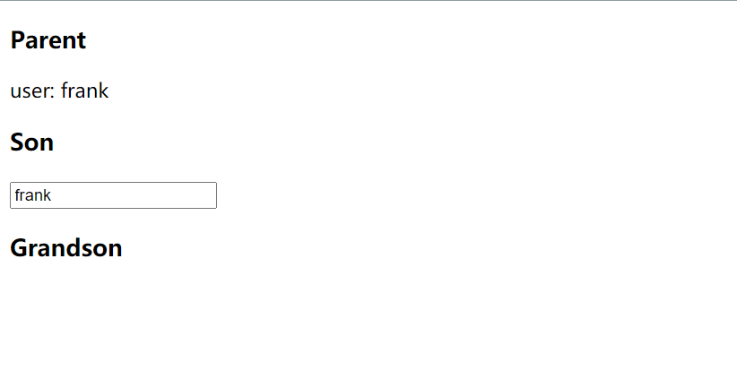
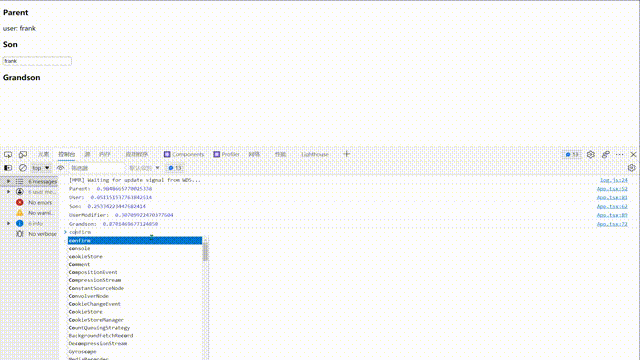
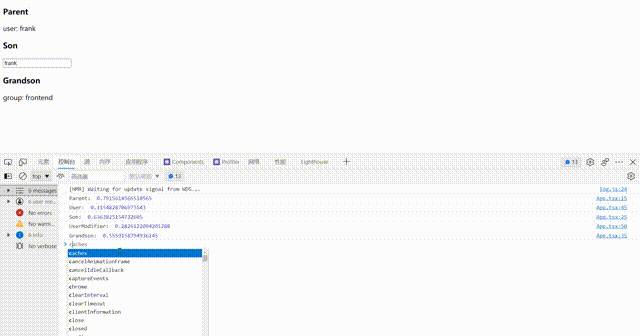
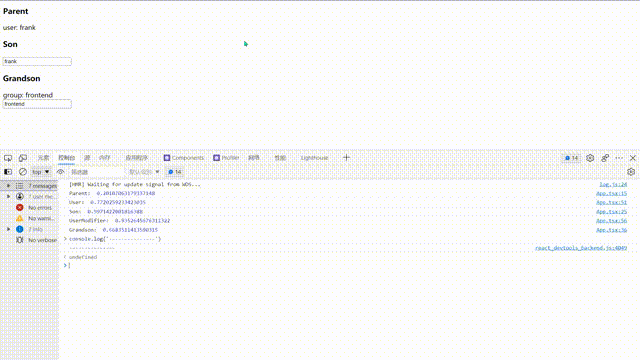

（本文是基于 [Redux 源码专精（17 集完整版）](https://www.bilibili.com/video/BV1254y1L7UP) 的学习笔记）

## 引例

```jsx
// App.jsx
import { useState, useContext, createContext } from 'react'

const AppContext = createContext(null)
const App = () => {
  const [appState, setAppState] = useState({
    user: { name: 'frank', age: 18 },
  })

  const contextValue = { appState, setAppState }
  return (
    <AppContext.Provider value={contextValue}>
      <Parent />
      <Son />
      <Grandson />
    </AppContext.Provider>
  )
}

const Parent = () => (
  <section>
    <h3>Parent</h3>
    <User />
  </section>
)

const Son = () => (
  <section>
    <h3>Son</h3>
    <UserModifier />
  </section>
)

const Grandson = () => (
  <section>
    <h3>Grandson</h3>
  </section>
)

const User = () => {
  const contextValue = useContext(AppContext)
  return <div>user: {contextValue.appState.user.name}</div>
}

const UserModifier = () => {
  const { appState, setAppState } = useContext(AppContext)
  const onChange = e => {
    appState.user.name = e.target.value
    setAppState({ ...appState })
  }
  return (
    <div>
      <input value={appState.user.name} onChange={onChange} />
    </div>
  )
}

export default App
```

我们创建一个 `AppContext` 共享 `user` 数据。
同时，创建三个组件 `Parent`、`Son` 和 `Grandson`。
其中，`Parent` 用户展示用户信息，`Son` 用于修改用户信息，
`Grandson` 什么都不做，也不使用 `AppContext`，相当于一个
`PureComponent`。

<div style="text-align: center;"></div>

此外，我们还创建了 `User` 和 `UserModifier` 用来展示具体的用户
和修改用户。

考虑 `UserModifier` 的代码：

```jsx{4,5}
const UserModifier = () => {
  const { appState, setAppState } = useContext(AppContext)
  const onChange = e => {
    appState.user.name = e.target.value
    setAppState({ ...appState })
  }
  return (
    <div>
      <input value={appState.user.name} onChange={onChange} />
    </div>
  )
}
```

我们直接修改了 `appState` 上的数据。显然，这种做法是非常
不规范的。为了规范创建 `state`，我们就需要一个函数来帮忙。

## `Reducer` 的由来

我们创建一个 `createNewState` 的函数，用来帮助我们创建一个新的 `state`。

```jsx
// App.jsx
/**
 * 基于旧的 `state` 创建新的 `state`，如果不需要改变原有的 `state`，则返回上一次的 `state`。
 * @param state oldState
 * @param actionType
 * @param actionData
 * @returns newState
 */
const createState = (state, actionType, actionData) => {
  if (actionType === 'updateUser') {
    return {
      ...state,
      user: {
        ...state.user,
        ...actionData,
      },
    }
  }
  return state
}
```

有了 `createState` 函数，我们就可以规范我们创建 `state` 的过程。

```jsx{4,5}
// App.jsx
const UserModifier = () => {
  const { appState, setAppState } = useContext(AppContext)
  const onChange = e =>
    setAppState(createState(appState, 'updateUser', { name: e.target.value }))

  return (
    <div>
      <input value={appState.user.name} onChange={onChange} />
    </div>
  )
}
```

可以看到，我们上面的 `createState` 函数非常像 `Reducer`，那么干脆就把它叫做 `reducer`。同时，我们还可以把 `actionType` 和 `actionData` 参数合并成一个参数。

下面是具体的修改：

```jsx{8,9,14,24-30}
// App.jsx
/**
 * 基于旧的 `state` 创建新的 `state`，如果不需要改变原有的 `state`，则返回上一次的 `state`。
 * @param state
 * @param { type: string, payload: any }
 * @returns newState
 */
const reducer = (state, { type, payload }) => {
  if (type === 'updateUser') {
    return {
      ...state,
      user: {
        ...state.user,
        ...payload,
      },
    }
  }
  return state
}

// ...
const UserModifier = () => {
  const { appState, setAppState } = useContext(AppContext)
  const onChange = e =>
    setAppState(
      reducer(appState, {
        type: 'updateUser',
        payload: { name: e.target.value },
      }),
    )

  return (
    <div>
      <input value={appState.user.name} onChange={onChange} />
    </div>
  )
}
```

这就是 `Reducer` 的由来：**用于规范我们创建 `state` 的过程。**

## `Dispatch` 的由来

dispatch 主要是用来规范我们 `setState` 的过程。来看我们上面 `setState` 的过程：

```jsx
const onChange = e =>
  setAppState(
    reducer(appState, {
      type: 'updateUser',
      payload: { name: e.target.value },
    }),
  )
```

显然前面的部分重复性太高了。例如：我们要修改 `user.age`，那么我们可能会写出如下代码：

```jsx{5}
const onChange = e =>
  setAppState(
    reducer(appState, {
      type: 'updateUser',
      payload: { age: 20 },
    }),
  )
```

为了规范 `setState`，我们可以把上面的代码进行抽离：

```jsx
// App.jsx
const dispatch = action => {
  setAppState(reducer(appState, action))
}
```

但是，新的问题又出现了，非组件内部无法访问到 `setState`。最干脆的办法是将创建 `setState` 的 `hook` 也提炼到 `dispatch`。但这样做不利于我们后续对于 `dispatch` 的抽离。于是我们可以创建
一个组件，然后把 `dispatch` 传给这个组件。听起来很麻烦，让我们直接看代码实现：

```jsx
// App.jsx
const Wrapper = () => {
  const { appState, setAppState } = useContext(AppContext)
  const dispatch = action => {
    setAppState(reducer(appState, action))
  }
  return <UserModifier dispatch={dispatch} state={appState} />
}
```

有了 `Wrapper` 组件，我们就可以拿到 `context`，然后我们将封装好的 `dispatch` 传给 `UserModifier` 组件。

同时，我们还需要对 `UserModifier` 进行修改，从 `props` 中拿到 `state`，
也可以拿到修改 `state` 的方法（`dispatch`）。

```jsx{1,4,8}
// App.jsx
const UserModifier = ({ dispatch, state }) => {
  const onChange = e =>
    dispatch({ type: 'updateUser', payload: { name: e.target.value } })

  return (
    <div>
      <input value={state.user.name} onChange={onChange} />
    </div>
  )
}
```

其次，我们还需要对使用到 `UserModifier` 的地方进行修改，改为 `Wrapper`。

```jsx{5}
// App.jsx
const Son = () => (
  <section>
    <h3>Son</h3>
    <Wrapper />
  </section>
)
```

经过上面的操作，我们实现使用 `dispatch` 规范 `setState` 的过程。

## `Connect` 的由来

我们上面使用 `Wrapper` 对 `UserModifier` 进行包装，使用的时候也需要使用 `Wrapper`
才能使 `UserModifier` 正常工作（否则从 `props` 获取不到 `dispatch` 和 `state`）。
因此，我们任何一个组件想要从 `props` 获取 `dispatch` 和 `state` 都需要封装一个像
`Wrapper` 的组件。如果是这样做的话，工作量会很大。所以我们可以封装一个 `createWrapper`
的函数，用来创建 `Wrapper`。

```jsx{3,8}
// App.jsx
const createWrapper = Component => {
  const Wrapper = props => {
    const { appState, setAppState } = useContext(AppContext)
    const dispatch = action => {
      setAppState(reducer(appState, action))
    }
    return <Component {...props} dispatch={dispatch} state={appState} />
  }
  return Wrapper
}
```

可以看到，我们只是把 `Wrapper` 的代码直接帮运到 `createWrapper` 中，然后修改其中一小部分
从而实现创建通用组件的 `Wrapper` 和 `props` 透传。对应上面的第 3, 8 行代码。

然后我们就可以修改 `Wrapper` 的代码：

```jsx
// App.jsx
const Wrapper = createWrapper(UserModifier)
```

这里需要注意一下 `Wrapper` 的创建顺序应该在 `UserModifier` 后面。

事实上，我们[现在的代码](#connect-的由来代码部分)还可以进行优化，由于 `UserModifier` 只用到一次，我们就
直接将他丢进 `createWrapper` 里面。同时，我们将 `Wrapper` 修改为 `UserModifier`。

```jsx
// App.jsx
const Son = () => (
  <section>
    <h3>Son</h3>
    {/* 将 Wrapper 修改为 UserModifier */}
    <UserModifier />
  </section>
)

// 将 Wrapper 修改为 UserModifier
// 同时，将原先的 UserModifier 的代码放在 createWrapper 的参数中。
const UserModifier = createWrapper(({ dispatch, state }) => {
  const onChange = e =>
    dispatch({ type: 'updateUser', payload: { name: e.target.value } })

  return (
    <div>
      <input value={state.user.name} onChange={onChange} />
    </div>
  )
})
```

经过上面的改造，我们创建组件的过程就是在组件外部创建一个 `Wrapper`。
也就是说 `createWrapper` 将组件与全局状态连接起来。所以在 `React-Redux`
中把 `createWrapper` 函数叫做 `connect`。

所以，我们可以对 `createWrapper` 进行简单的修改：

```jsx{16}
// App.jsx
// 将 createWrapper 改名为 connect
// 同时，优化内部代码。
const connect = Component => {
  return props => {
    const { appState, setAppState } = useContext(AppContext)
    const dispatch = action => {
      setAppState(reducer(appState, action))
    }
    return <Component {...props} dispatch={dispatch} state={appState} />
  }
}

// 将 Wrapper 修改为 UserModifier
// 同时，将原先的 UserModifier 的代码放在 createWrapper 的参数中。
const UserModifier = connect(({ dispatch, state }) => {
  const onChange = e =>
    dispatch({ type: 'updateUser', payload: { name: e.target.value } })

  return (
    <div>
      <input value={state.user.name} onChange={onChange} />
    </div>
  )
})
```

## 使用 `connect` 减少 `render`

我们现在的代码存在一个问题：太多的 `render` 了。我们可以在每个组件内部添加一些 log 信息进行观察：

```jsx{3,13,23,31,37}
// App.jsx
const Parent = () => {
  console.log('Parent: ', Math.random())
  return (
    <section>
      <h3>Parent</h3>
      <User />
    </section>
  )
}

const Son = () => {
  console.log('Son: ', Math.random())
  return (
    <section>
      <h3>Son</h3>
      <UserModifier />
    </section>
  )
}

const Grandson = () => {
  console.log('Grandson: ', Math.random())
  return (
    <section>
      <h3>Grandson</h3>
    </section>
  )
}
const User = () => {
  console.log('User: ', Math.random())
  const contextValue = useContext(AppContext)
  return <div>user: {contextValue.appState.user.name}</div>
}

const UserModifier = connect(({ dispatch, state }) => {
  console.log('UserModifier: ', Math.random())
  const onChange = e =>
    dispatch({ type: 'updateUser', payload: { name: e.target.value } })

  return (
    <div>
      <input value={state.user.name} onChange={onChange} />
    </div>
  )
})
```

来看控制台的输出结果：

<div style="text-align: center;"></div>

<div style="text-align: center;"></div>

我们输入了 2 次，发现所有组件都执行了各自的 `render` 方法，这显然是有问题的。因为我们有些组件压根就没有
依赖 `state`，所以没必要进行 `render`。

造成这个问题主要在于我们最终的 `setState` 是来自 `App` 组件中的 `setAppState`，所以一旦数据发生变化，
我们就会执行 `App` 的 `render` 方法，自然而然就会执行子组件的 `render` 方法。

那么我们就需要 `Redux` 为我们提供一种机制，就是只有依赖到相应 `state`的组件才能触发它的 `render` 方法。
接下来我们就开始改造 `state` 和 `setState`。

首先我们需要用中央集成仓库，用来存放 `state`。同时，提供一个 `setState` 的方法。

```jsx
// App.jsx
const store = {
  state: {
    user: { name: 'frank', age: 18 }, // 暂且进行简单的初始化
  },
  setState(newState) {
    console.log(newState) // 用于调试
    store.state = newState
  },
}
```

然后我们就需要改造 `App` 组件的代码了，直接使用 `store` 作为 `context` 的 `value`。

```jsx{3}
const App = () => {
  return (
    <AppContext.Provider value={store}>
      <Parent />
      <Son />
      <Grandson />
    </AppContext.Provider>
  )
}
```

接下来就轮到 `connect` 函数了，`connect` 函数不再从 `context` 中获取 `state`，而是从
`store` 中直接获取：

```jsx{3}
const connect = Component => {
  return props => {
    const { state, setState } = store
    const dispatch = action => {
      setState(reducer(state, action))
    }
    return <Component {...props} dispatch={dispatch} state={state} />
  }
}
```

最后，`User` 也需要修改一下：

```jsx{3,4}
// App.sjx
const User = () => {
  console.log('User: ', Math.random())
  const { state } = useContext(AppContext)
  return <div>user: {state.user.name}</div>
}
```

让我们回过头来看我们的页面：我们在输入框中输入后会发现我们的页面更新不了，但是
控制台却有输出，这究竟是为什么呢？事实上，我们没有调用 React 为我们提供的 `setState`
刷新页面自然页面就更新不了。

为了让我们的页面能够更新，我们可以在 `dispatch` 时对页面就行更新，这里就需要修改 `connect` 的代码：

```jsx{5,8}
// App.sjx
const connect = Component => {
  return props => {
    const { state, setState } = store
    const [, update] = useState({})
    const dispatch = action => {
      setState(reducer(state, action))
      update({})
    }
    return <Component {...props} dispatch={dispatch} state={state} />
  }
}
```

这样就确保了只有 `connect` 的组件（也是依赖到 `state` 的组件）才会刷新页面。
此外，我们还需要需改 `User` 组件，让他也依赖到 `store` 中的 `state`。

```jsx{2}
// App.jsx
const User = connect(({ state }) => {
  console.log('User: ', Math.random())
  return <div>user: {state.user.name}</div>
})
```

<div style="text-align: center;"></div>

可以看到，现在我们输入框会随着我们的输入而改变。但是上面 `<User />` 展示仍然会不会发生改变。
这是因为每个 `connect` 的组件都有自己的 `dispatch` 方法（仔细去看一下 `connect` 的
实现就可以明白了），`UserModifier` 的 `dispatch`
并不会触发 `User` 的 `dispatch`，所以我们就需要进行**订阅**。

接下来我们修改一下 `store`，让其提供订阅的功能：

```jsx{8,10-17}
// App.jsx
const store = {
  state: {
    user: { name: 'frank', age: 18 }, // 暂且进行简单的初始化
  },
  setState(newState) {
    store.state = newState
    store.listeners.forEach(fn => fn(store.state))
  },
  listeners: [],
  subscribe(fn) {
    store.listeners.push(fn)
    return () => {
      const index = store.listeners.indexOf(fn)
      if (index >= 0) store.listeners.splice(index, 1)
    }
  },
}
```

在 `store` 内部保存一个 `listeners` 数组，用来保存订阅者。
在提供的 `subscribe` 函数中，我们还返回了一个函数，用来取消订阅。

然后在每一次的 `setState` 时，我们去通知订阅者 `state` 已经更新，
同时传给最新的 `state`。

接下来我们对需要用到 `store` 中 `state` 的组件进行订阅，换句话说，我们
需要在 `connect` 进行 `subscribe` ：

```jsx{8,10-12}
// App.jsx
const connect = Component => {
  return props => {
    const { state, setState } = store
    const [, update] = useState({})

    // 别忘了导入 useEffect
    useEffect(() => store.subscribe(() => update({})), [])

    const dispatch = action => {
      setState(reducer(state, action))
    }
    return <Component {...props} dispatch={dispatch} state={state} />
  }
}
```

注意这里 `useEffect` 的用法，返回 `store.subscribe()` 在下一次 `render` 的时候，
取消副作用。可以看到我们更新 `state` 的时候，只有依赖到 `state` 的组件才会更新。

<div style="text-align: center;"></div>

## React-Redux

至此，我们已经实现 `React-Redux` 的大部分功能，接下来我们就需要将相关的代码移动到
[单独的文件](#react-redux-雏形)。

## mapStateToProps

在讲 `mapStateToProps` 之前来看一下我们的 `User` 组件：

```jsx
const User = connect(({ state }) => {
  console.log('User: ', Math.random())
  return <div>user: {state.user.name}</div>
})
```

可以看到 `User` 组件只用到了 `user`，那么我们能否在 `connect`
连接组件的时候直接拿到对应的数据？就像下面操作一样：

```jsx
// App.jsx
const User = connect(state => ({ user: state.user }))(({ user }) => {
  console.log('User: ', Math.random())
  return <div>user: {user.name}</div>
})
```

这样做的好处在于我们可以快速地获取局部的 `state`，而不需要进行
层层层层访问才能获取到 `state`。

接下来我们从代码的层面实现这个功能：

```jsx{2,8,9}
// react-redux.jsx
export const connect = mapStateToProps => Component => {
  return props => {
    const { state, setState } = store
    const [, update] = useState({})
    useEffect(() => store.subscribe(() => update({})), [])

    const data =
      typeof mapStateToProps === 'function'
        ? mapStateToProps(state)
        : { state }

    const dispatch = action => {
      setState(reducer(state, action))
    }
    return <Component {...props} dispatch={dispatch} {...data} />
  }
}
```

接下来，我们就需要在使用到 `connect` 的地方进行修改，需要预先执行
`connect`：

```jsx{2}
// App.jsx
const UserModifier = connect()(({ dispatch, state }) => {
  // ...
})
```

## 精准渲染

来看一下我们现在还存在的问题：我们在 `store` 添加一个新的 `state`，
然后在 `Grandson` 组件中，我们使用这个新的 `state`：

```jsx{5,11,16}
// react-redux.jsx
export const store = {
  state: {
    user: { name: 'frank', age: 18 }, // 暂且进行简单的初始化
    group: { name: 'frontend' },
  },
  // ...
}

// App.jsx
const Grandson = connect(state => ({ group: state.group }))(({ group }) => {
  console.log('Grandson: ', Math.random())
  return (
    <section>
      <h3>Grandson</h3>
      <div>group: {group.name}</div>
    </section>
  )
})
```

我们知道，`Grandson` 组件只依赖到 `state.group`，如果我们更新
`state` 的其他数据， `Grandson` 不应该被更新，但实际上，`Grandson`
会随着 `state` 的更新而更新，来看下面的运行结果：

<div style="text-align: center;"></div>

<div style="text-align: center;"></div>

于是我们需要修改一下更新策略，这里需要借助一个函数用来判断两个对象是否相同，
我们这个函数放在 `utils.js` 文件中。

```jsx
// utils.js
export const shallowEqual = (o1, o2) => {
  if (o1 === o2) {
    return true
  }

  if (
    typeof o1 !== 'object' ||
    o1 === null ||
    typeof o2 !== 'object' ||
    o2 === null
  ) {
    return false
  }

  const keysO1 = Object.keys(o1)
  if (keysO1.length !== Object.keys(o2).length) {
    return false
  }

  for (const key of keysO1) {
    if (!o2.hasOwnProperty(key) || o1[key] !== o2[key]) {
      return false
    }
  }

  return true
}
```

有了这个工具函数，我们就可以着手实现**精准渲染**。

```jsx{12-16}
// react-redux.jsx
export const connect = mapStateToProps => Component => {
  return props => {
    const [, update] = useState({})
    mapStateToProps =
      typeof mapStateToProps === 'function'
        ? mapStateToProps
        : state => ({ state })
    const data = mapStateToProps(store.state)

    useEffect(
      () =>
        store.subscribe(() => {
          const newData = mapStateToProps(store.state)
          if (!shallowEqual(data, newData)) {
            update({})
          }
        }),
      [data],
    )

    const dispatch = action => {
      store.setState(reducer(store.state, action))
    }
    return <Component {...props} dispatch={dispatch} {...data} />
  }
}
```

核心逻辑放在 `subscribe` 中，决定我们是否需要更新视图。
**这里需要注意的是**在第 12 行（也就是 `const newData = mapStateToProps(store.state)`）
根据 `state` 创建新数据的时候，我们需要传入 `store.state` 以确保拿到**最新的**
`state`。如果还是采用**老的** `state` 去执行 `mapStateToProps`
那么 `shallowEqual(data, newData)`的结果一定是 `true`。

为了看出区别，我们在 `Grandson` 中也添加一个修改的功能：

```jsx{3,5,6,12}
// App.jsx
const Grandson = connect(state => ({ group: state.group }))(
  ({ group, dispatch }) => {
    console.log('Grandson: ', Math.random())
    const onChange = e => {
      dispatch({ type: 'updateGroup', payload: { name: e.target.value } })
    }
    return (
      <section>
        <h3>Grandson</h3>
        <div>group: {group.name}</div>
        <input type='text' value={group.name} onChange={onChange} />
      </section>
    )
  },
)
```

下面请看实现后的结果：

<div style="text-align: center;"></div>

<div style="text-align: center;"></div>

可以看到，修改 `user` 的时候，组件 `Grandson` 不再更新，但是 `UserModifier` 会
更新，因为我们在创建 `UserModifier` 的时候，没有指明 `connect()` 的 `mapStateToProps`
所以会采用 `store.state` 作为默认参数。

## mapDispatchToProps

接下来我们要实现 `mapDispatchToProps` 功能。这个功能允许我们直接
调用 `dispatch`，例如下面的示例：

```jsx
// App.jsx
const UserModifier = connect(null, dispatch => {
  return {
    updateUser: payload => dispatch({ type: 'updateUser', payload }),
  }
})(({ updateUser, state }) => {
  console.log('UserModifier: ', Math.random())
  const onChange = e => updateUser({ name: e.target.value })

  return (
    <div>
      <input value={state.user.name} onChange={onChange} />
    </div>
  )
})
```

对比之前的 `dispatch` 过程，我们可以看到上面的实现非常简洁：

```jsx
// 之前的 dispatch
dispatch({ type: 'updateUser', payload: { name: e.target.value } })

// 使用 mapDispatchToProps 后
updateUser({ name: e.target.value })
```

让我们开始动手吧！

```jsx{2,12-15,28}
// react-redux.jsx
export const connect = (mapStateToProps, mapDispatchToProps) => Component => {
  return props => {
    const [, update] = useState({})
    const dispatch = action => {
      store.setState(reducer(store.state, action))
    }

    mapStateToProps =
      typeof mapStateToProps === 'function'
        ? mapStateToProps
        : state => ({ state })
    const data = mapStateToProps(store.state)

    const dispatchers =
      typeof mapDispatchToProps === 'function'
        ? mapDispatchToProps(dispatch)
        : { dispatch }

    useEffect(
      () =>
        store.subscribe(() => {
          const newData = mapStateToProps(store.state)
          if (!shallowEqual(data, newData)) {
            update({})
          }
        }),
      [data],
    )

    return <Component {...props} {...dispatchers} {...data} />
  }
}
```

## 回头看 `connect`

回过头来我们来看 `connect` 的实现：

```jsx
connect(mapStateToProps, mapDispatchToProps)(Component)
```

我们不经思考，为什么 `react-redux` 不把这三个参数放在一个函数中呢？
而是闭包的方式进行缓存。

在回答这个问题之前，我们来修改一下我们的代码。
由于我们的组件 `User` 和 `UserModifier` 都是对 `state.user`
的读和写操作，我们何尝不把这两个组件的创建过程进行提炼？

先来看未提炼之前的代码：

```jsx
// App.sjx
const User = connect(state => ({ user: state.user }))(({ user }) => {
  console.log('User: ', Math.random())
  return <div>user: {user.name}</div>
})

const UserModifier = connect(null, dispatch => {
  return {
    updateUser: payload => dispatch({ type: 'updateUser', payload }),
  }
})(({ updateUser, state }) => {
  console.log('UserModifier: ', Math.random())
  const onChange = e => updateUser({ name: e.target.value })

  return (
    <div>
      <input value={state.user.name} onChange={onChange} />
    </div>
  )
})
```

接下来，我们就将这个创建过程进行提炼：

```jsx{1-5}
// App.jsx
const userSelector = state => ({ user: state.user })
const userDispatchers = dispatch => ({
  updateUser: payload => dispatch({ type: 'updateUser', payload }),
})
const User = connect(
  userSelector,
  userDispatchers,
)(({ user }) => {
  console.log('User: ', Math.random())
  return <div>user: {user.name}</div>
})

const UserModifier = connect(
  userSelector,
  userDispatchers,
)(({ updateUser, user /* 注意要将 state 修改为 user */ }) => {
  console.log('UserModifier: ', Math.random())
  const onChange = e => updateUser({ name: e.target.value })

  return (
    <div>
      <input value={user.name /* 这里也需要稍作修改 */} onChange={onChange} />
    </div>
  )
})
```

可以看到我们的代码又变得非常简洁。其实，我们还可以进一步优化将 `connect(xxx)`
进一步提炼：

```jsx{6}
// App.jsx
const userSelector = state => ({ user: state.user })
const userDispatchers = dispatch => ({
  updateUser: payload => dispatch({ type: 'updateUser', payload }),
})
const connectToUser = connect(userSelector, userDispatchers)

const User = connectToUser(({ user }) => {
  console.log('User: ', Math.random())
  return <div>user: {user.name}</div>
})

const UserModifier = connectToUser(({ updateUser, user }) => {
  console.log('UserModifier: ', Math.random())
  const onChange = e => updateUser({ name: e.target.value })

  return (
    <div>
      <input value={user.name} onChange={onChange} />
    </div>
  )
})
```

有了前面的准备工作，我们接下来还可以将提炼出来的 `connectToUser` 抽离
到另外一个文件夹中。我们创建一个 `connectors` 文件夹，用于存放 `connect`
创建的 `connectors`。

```jsx
// connectors/connect-to-user.jsx
import { connect } from '../react-redux'

const userSelector = state => ({ user: state.user })
const userDispatchers = dispatch => ({
  updateUser: payload => dispatch({ type: 'updateUser', payload }),
})
export const connectToUser = connect(userSelector, userDispatchers)
```

接下来我们就可以把 `App.jsx` 中涉及到 `connectToUser` 部分的代码删除，
同时从 `connectors/connect-to-user` 中导入 `connectToUser` 即可。

完成上述操作后，我们再来回答一开始的问题：为什么 `react-redux` 不把这三个参数放在一个函数中呢？

从实现来看，`mapStateToProps` 用来封装读取 `state` 的操作，
`mapDispatchToProps` 用来封装写入 `state` 的操作，
而 `connect(mapStateToProps, mapDispatchToProps)` 是用来
封装读写 `state` 的操作。

之所以分成两次调用，是为了让我们创建一个半成品，允许我们与不同组件相结合，
同时使用闭包进行缓存提高程序运行的效率。

## Appendix

### `Connect` 的由来代码部分

```jsx
import { useState, useContext, createContext } from 'react'

/**
 * 基于旧的 `state` 创建新的 `state`，如果不需要改变原有的 `state`，则返回上一次的 `state`。
 * @param state
 * @param { type: string, payload: any }
 * @returns newState
 */
const reducer = (state, { type, payload }) => {
  if (type === 'updateUser') {
    return {
      ...state,
      user: {
        ...state.user,
        ...payload,
      },
    }
  }
  return state
}

const AppContext = createContext(null)
const App = () => {
  const [appState, setAppState] = useState({
    user: { name: 'frank', age: 18 },
  })

  const contextValue = { appState, setAppState }
  return (
    <AppContext.Provider value={contextValue}>
      <Parent />
      <Son />
      <Grandson />
    </AppContext.Provider>
  )
}

const Parent = () => (
  <section>
    <h3>Parent</h3>
    <User />
  </section>
)

const Son = () => (
  <section>
    <h3>Son</h3>
    <Wrapper />
  </section>
)

const Grandson = () => (
  <section>
    <h3>Grandson</h3>
  </section>
)

const User = () => {
  const contextValue = useContext(AppContext)
  return <div>user: {contextValue.appState.user.name}</div>
}

const createWrapper = Component => {
  const Wrapper = props => {
    const { appState, setAppState } = useContext(AppContext)
    const dispatch = action => {
      setAppState(reducer(appState, action))
    }
    return <Component {...props} dispatch={dispatch} state={appState} />
  }
  return Wrapper
}

const UserModifier = ({ dispatch, state }) => {
  const onChange = e =>
    dispatch({ type: 'updateUser', payload: { name: e.target.value } })

  return (
    <div>
      <input value={state.user.name} onChange={onChange} />
    </div>
  )
}
const Wrapper = createWrapper(UserModifier)

export default App
```

### React-Redux 雏形

```jsx
// react-redux.jsx
import { createContext, useState, useEffect } from 'react'
export const AppContext = createContext(null)
export const store = {
  state: {
    user: { name: 'frank', age: 18 }, // 暂且进行简单的初始化
  },
  setState(newState) {
    store.state = newState
    store.listeners.forEach(fn => fn(store.state))
  },
  listeners: [],
  subscribe(fn) {
    store.listeners.push(fn)
    return () => {
      const index = store.listeners.indexOf(fn)
      if (index >= 0) store.listeners.splice(index, 1)
    }
  },
}

export const connect = Component => {
  return props => {
    const { state, setState } = store
    const [, update] = useState({})

    useEffect(() => store.subscribe(() => update({})), [])

    const dispatch = action => {
      setState(reducer(state, action))
    }
    return <Component {...props} dispatch={dispatch} state={state} />
  }
}

/**
 * 基于旧的 `state` 创建新的 `state`，如果不需要改变原有的 `state`，则返回上一次的 `state`。
 * @param state
 * @param { type: string, payload: any }
 * @returns newState
 */
const reducer = (state, { type, payload }) => {
  if (type === 'updateUser') {
    return {
      ...state,
      user: {
        ...state.user,
        ...payload,
      },
    }
  }
  return state
}
```

```jsx
// App.jsx
import { AppContext, connect, store } from './react-redux'

const App = () => {
  return (
    <AppContext.Provider value={store}>
      <Parent />
      <Son />
      <Grandson />
    </AppContext.Provider>
  )
}

const Parent = () => {
  console.log('Parent: ', Math.random())
  return (
    <section>
      <h3>Parent</h3>
      <User />
    </section>
  )
}

const Son = () => {
  console.log('Son: ', Math.random())
  return (
    <section>
      <h3>Son</h3>
      <UserModifier />
    </section>
  )
}

const Grandson = () => {
  console.log('Grandson: ', Math.random())
  return (
    <section>
      <h3>Grandson</h3>
    </section>
  )
}

const User = connect(({ state }) => {
  console.log('User: ', Math.random())
  return <div>user: {state.user.name}</div>
})

// 将 Wrapper 修改为 UserModifier
// 同时，将原先的 UserModifier 的代码放在 createWrapper 的参数中。
const UserModifier = connect(({ dispatch, state }) => {
  console.log('UserModifier: ', Math.random())
  const onChange = e =>
    dispatch({ type: 'updateUser', payload: { name: e.target.value } })

  return (
    <div>
      <input value={state.user.name} onChange={onChange} />
    </div>
  )
})

export default App
```
