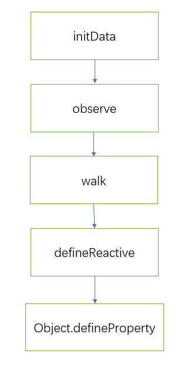
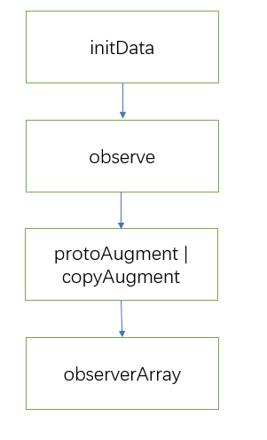
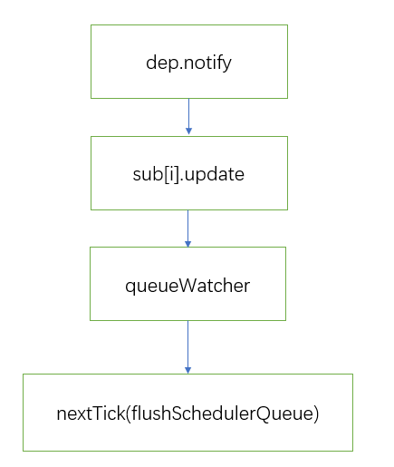

## 关于 MVVM 原理的理解


MVVM 将数据层和视图层分离开，使用一个中间的控制器将视图层
和数据层连接起来，这个控制器称之为 *ViewModel*，数据层
称之为 *Model* 而视图层称之为 *View*。

### ViewModel

ViewModel 作为 View 和 Model 的连接体。每当 Model 发生变化的时候就会去通知
相应的 View 进行更新；而当 View 相应（例如：UI 点击事件等）操作数据
的时候，ViewModel 又会将其反作用到对应的 Model。

vue 并没有完全遵守 MVVM 模型，它更关注于 ViewModel 的实现。
在 vue 中每一个 Vue 实例都算是一个 ViewModel。

### View

视图，可以是真实的 DOM。
在 vue 中，真实 DOM 由 Vue 实例进行管理，DOM 元素被封装到
实例的 `$el` 中，我们基本上不需要直接操作 DOM 元素，我们可以
通过 vue 提供的 API 接口对 DOM 元素进行操作。

### model

可以称作数据层。在 vue 中，model 是一个被略微修改过的**纯 javascript 对象**。
之所以是被略微修改，是由于 vue 为了实现响应式采用了数据劫持的
方式对原有的对象进行修改。然后将数据封装到实例的 `$data` 上。


## 响应式数据的原理

vue2 实现数据响应式的核心原理是通过 `Object.defineProperty`
对数据进行拦截而实现的。

vue2 在初始化数据的时候，会使用 `Object.defineProperty` 对数据
重新定义。当用户获取或者设置数据的时候会触发相应的 `getter` 和
`setter`，所以 vue 会在 `getter` 中收集依赖，在 `setter` 中
实现数据的响应化更新。

响应式数据采用了观察者模式实现的。在 `getter` 中订阅（也就
是依赖收集），在 `setter` 使用 `notify` 通知视图更新。

整个过程（针对对象）可以大致描述为如下的图：



vue 在创建实例的时候，会调用 `initMixin`，在 `initMixin` 中
会对数据进行代理和初始化(`initData`)。在初始化数据的时候，
会通过 `Observer` 对当前数据进行观察，并收集依赖。当数据为对象
时，会调用 `Observer.prototype.walk` 遍历对象里面的所有 `key`，
然后调用 `defineReactive` 实现响应式。而 `defineReactive` 实现
响应式的真正核心代码是通过 `Object.defineProperty` 实现的。

来看 `defineReactive` 中的部分代码：
```javascript
function defineReactive(/* ... */) {
  // statement...

  Object.defineProperty(obj, key, {
    enumerable: true,
    configurable: true,
    get: function reactiveGetter () {
      const value = getter ? getter.call(obj) : val
      if (Dep.target) {
        // ⬇⬇⬇⬇⬇⬇⬇⬇⬇⬇⬇⬇⬇⬇⬇⬇⬇⬇⬇⬇⬇⬇⬇⬇⬇⬇
        dep.depend()
        if (childOb) {
          childOb.dep.depend()
          if (Array.isArray(value)) {
            dependArray(value)
          }
        }
      }
      return value
    },
    set: function reactiveSetter (newVal) {
      const value = getter ? getter.call(obj) : val
      /* eslint-disable no-self-compare */
      if (newVal === value || (newVal !== newVal && value !== value)) {
        return
      }
      /* eslint-enable no-self-compare */
      if (process.env.NODE_ENV !== 'production' && customSetter) {
        customSetter()
      }
      // #7981: for accessor properties without setter
      if (getter && !setter) return
      if (setter) {
        setter.call(obj, newVal)
      } else {
        val = newVal
      }
      childOb = !shallow && observe(newVal)
      // ⬇⬇⬇⬇⬇⬇⬇⬇⬇⬇⬇⬇⬇⬇⬇⬇⬇⬇⬇⬇⬇⬇⬇⬇⬇⬇
      dep.notify()
    }
  })
}
```

在 `Object.defineProperty` 中的 `getter` 通过调
用 `dep.depend()` 收集依赖。在 `setter` 中通过调
用 `dep.notify` 通知视图响应式更新。

## Vue 是如何检测数组的变化

数组没办法像对象那样直接通过 `defineProperty` 进行数据拦截，
因为使用做的话，使用数组的 `shift, unshift, append` 等
这些修改数组的方法无法触发响应式。所以 vue 对数组进行额外的
操作。



前面实现响应式的过程与对象类似。但是在 `new Observer` 中
vue 会修改当前数组原型上的方法（是 `protoAugment` 
还是 `copyAgument` 取决于 `'__proto__' in {}`），
，内部还是会调用 `dep.notify()`。下面是 vue 中如何对数组
的方法进行修改的代码：
```javascript
odsToPatch = [
  'push',
  'pop',
  'shift',
  'unshift',
  'splice',
  'sort',
  'reverse'
]

/**
 * Intercept mutating methods and emit events
 */
methodsToPatch.forEach(function (method) {
  // cache original method
  const original = arrayProto[method]
  def(arrayMethods, method, function mutator (...args) {
    const result = original.apply(this, args)
    const ob = this.__ob__
    let inserted
    switch (method) {
      case 'push':
      case 'unshift':
        inserted = args
        break
      case 'splice':
        inserted = args.slice(2)
        break
    }
    if (inserted) ob.observeArray(inserted)
    // notify change
    // ⬇⬇⬇⬇⬇⬇⬇⬇⬇⬇⬇⬇⬇⬇
    ob.dep.notify()
    return result
  })
})
```

同时，会遍历数组中的数据，对里面的每一项进行观察。

## 为何 Vue 采用异步渲染

采用异步渲染主要是出于性能考虑。Vue 是组件级更新，不可能单个数据
发生变化就立马更新视图，而是会先将发生变化的数据对应的 `Watcher`
放入到一个队列中，等当前组件数据更新完毕，调用 `nextTick` 实现
页面更新。


```javascript
// ./schedule.js
export function queueWatcher (watcher: Watcher) {
  const id = watcher.id
  if (has[id] == null) {
    has[id] = true
    if (!flushing) {
      // ⬇⬇⬇⬇⬇⬇⬇⬇⬇⬇⬇⬇⬇⬇⬇⬇
      queue.push(watcher)
    } else {
      // if already flushing, splice the watcher based on its id
      // if already past its id, it will be run next immediately.
      let i = queue.length - 1
      while (i > index && queue[i].id > watcher.id) {
        i--
      }
      queue.splice(i + 1, 0, watcher)
    }
    // queue the flush
    if (!waiting) {
      waiting = true

      if (process.env.NODE_ENV !== 'production' && !config.async) {
        flushSchedulerQueue()
        return
      }
      // ⬇⬇⬇⬇⬇⬇⬇⬇⬇⬇⬇⬇⬇⬇⬇⬇
      nextTick(flushSchedulerQueue)
    }
  }
}
```

## nextTick 的实现原理

## Vue 中的 Computed 的特点

## Watch 中的 `deep: true` 是如何实现的

## Vue 组件的声明周期


1. `beforeCreate`: 在 vue 实例创建之后，数据观测( data observer) 之前被调用。
2. `created`: 数据观测 ( data observer ) 和计算属性、方法等执行完成
   ，watch / event 事件回调也初始化完成，但此时并没有 `$el`。
3. `beforeMounted`: 挂载实例之前的生命函数钩子，此时 `render` 函数
   等初次调用。
4. `mounted`: 完成 `$el` 的创建并挂载到 DOM 上。
5. `beforeUpdate`: 数据更新时调用，发生在虚拟 DOM 重新
   渲染和打补丁之前。
6. `updated`: 由于数据更新导致虚拟 DOM 重新渲染和打补丁。
7. `beforeDestroy`: 在实例被销毁之前调用的一些清理工作。
8. `destroy`: 销毁实例。实例上的所有数据会解除绑定，所有的事件监听器
   会被移除。

**每个生命周期内部可以做的事情:**
1. `create`: 实例已经创建完成，可以拿到实例上面的数据，
   可以发送资源的请求。
2. `mounted`: 实例已经完成挂载，可以进行 DOM 操作。
3. `beforeUpdate`: 在数据渲染后更新操作之前，可以进一步修改
   状态。
4. `updated`: 可以执行更新后的 DOM 操作。大部分情况下，避免
   在这个阶段操作 DOM 元素。
5. `destroy`: 可以执行一些优化操作，例如：清空定时器，解除
   事件绑定从而避免内存泄露。


## ajax 请求应该放在哪个生命周期中

可以放在 `create` 或者是 `mounted` 中。
- 放在 `create` 中的话无法拿到 DOM 元素，但是其发送请求的优先级
  会高一点。
- 放在 `mounted` 中的话可以拿到渲染后的 DOM 元素。
  
但是，对于服务器渲染是没有 DOM 的概念。所以，可以统一使用浏览器
时在 `mounted` 发送请求；在服务器渲染的时候，在 `create` 中
请求数据。

## 什么时候要使用 beforeDestroy

## Vue 中模板编译的原理

## v-if 和 v-show 的区别

## 为什么 v-for 和 v-if 不能连用

## 用 vnode 来描述一个 DOM 结构

## diff 算法的时间复杂度

评级比较

## 简述 Vue 中的 diff 算法

## v-for 中为什么要用 key

不带 key 情况下，默认的 key 是 `undefined`。
vue 在执行 `diff` 算法的时候，由于两个 key 
相同，于是会执行 `patchVnode` 打补丁对节点进行复用。

对于一些 **无状态**的数据循环来说，不使用 `key` 可以提高
运行的效率。但是对于那些使用到状态的循环而言，如果不使用
key 的话，vue 复用子元素可能会出现一些 bug。
使用 key 会影响性能，如果操作了元素，vue 在 打补丁的时候
找不到可以复用的 `vnode`，则需要将旧的 `vnode` 删除，同时
操作 dom。
事实上，加上 key 对于性能的影响并不大，出于安全考虑，`v-for` 中
最好使用 `key`。

其次，key 最好是唯一的标识，如果简单地使用索引作为
key 的话，vue 在复用子元素的时候也可能出现 bug。

## 描述组件渲染和更新过程

## 组件中的 data 为什么是一个函数

## Vue 中事件绑定的原理

vue 中的事件绑定采用了两种方式：
1. 原生事件绑定。
2. 组件事件绑定。

当我们在 html 元素上绑定事件的时候，vue 最终会通过 `addEventListener` 的
方式为 DOM 元素绑定事件。

对于组件的事件绑定，vue 是通过使用自己的事件管理实现的（采用的是发布订阅模式）。

考虑下面的例子：

```js
const compiler = require('vue-template-compiler');

let r1 = compiler.compile('<div @click="fn()"></div>');
let r2 = compiler.compile('<my-component @click="fn()" @click.native="fn()"></my-component>');

console.log(r1.render);
console.log(r2.render);
/*
with(this){return _c('div',{on:{"click":function($event){return fn()}}})}
with(this){return _c('my-component',{on:{"click":function($event){return fn()}},nativeOn:{"click":function($event){return fn()}}})}
*/
```

从输出的结果上看，我们可以知道 vue 的事件绑定是有两种方式的，
让我们来看一下它大致的源码实现：
```javascript

```


## v-model 的实现原理以及如何定义 v-model

## v-html 会导致哪些问题

## Vue 父子组件生命周期的调用顺序

## Vue 组件是如何通信的

## Vue 中相同逻辑如何抽离

## 为什么要使用异步组件

## 什么是作用域插槽

## 浅谈 keep-alive

## Vue 中常见的性能优化

## Vue3.0 有哪些改进

## 实现 hash 路由和 history 路由

## Vue-Router 中导航守卫有哪些

## action 和mutation 的区别

## 简述 Vuex 的工作原理

