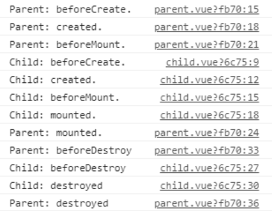

## 关于 MVVM 原理的理解


MVVM 将数据层和视图层分离开，使用一个中间的控制器将视图层
和数据层连接起来，这个控制器称之为 _ViewModel_，数据层
称之为 _Model_ 而视图层称之为 _View_。

### ViewModel

ViewModel 作为 View 和 Model 的连接体。每当 Model 发生变化的时候就会去通知
相应的 View 进行更新；而当 View 相应（例如：UI 点击事件等）操作数据
的时候，ViewModel 又会将其反作用到对应的 Model。

vue 并没有完全遵守 MVVM 模型，它更关注于 ViewModel 的实现。
在 vue 中每一个 Vue 实例都算是一个 ViewModel。

### View

视图，可以是真实的 DOM。
在 vue 中，真实 DOM 由 Vue 实例进行管理，DOM 元素被封装到
实例的 `$el` 中，我们基本上不需要直接操作 DOM 元素，我们可以
通过 vue 提供的 API 接口对 DOM 元素进行操作。

### model

可以称作数据层。在 vue 中，model 是一个被略微修改过的**纯 javascript 对象**。
之所以是被略微修改，是由于 vue 为了实现响应式采用了数据劫持的
方式对原有的对象进行修改。然后将数据封装到实例的 `$data` 上。

## 响应式数据的原理

vue2 实现数据响应式的核心原理是通过 `Object.defineProperty`
对数据进行拦截而实现的。

vue2 在初始化数据的时候，会使用 `Object.defineProperty` 对数据
重新定义。当用户获取或者设置数据的时候会触发相应的 `getter` 和
`setter`，所以 vue 会在 `getter` 中收集依赖，在 `setter` 中
实现数据的响应化更新。

响应式数据采用了观察者模式实现的。在 `getter` 中订阅（也就
是依赖收集），在 `setter` 使用 `notify` 通知视图更新。

整个过程（针对对象）可以大致描述为如下的图：


vue 在创建实例的时候，会调用 `initMixin`，在 `initMixin` 中
会对数据进行代理和初始化(`initData`)。在初始化数据的时候，
会通过 `Observer` 对当前数据进行观察，并收集依赖。当数据为对象
时，会调用 `Observer.prototype.walk` 遍历对象里面的所有 `key`，
然后调用 `defineReactive` 实现响应式。而 `defineReactive` 实现
响应式的真正核心代码是通过 `Object.defineProperty` 实现的。

来看 `defineReactive` 中的部分代码：

```javascript
function defineReactive(/* ... */) {
  // statement...

  Object.defineProperty(obj, key, {
    enumerable: true,
    configurable: true,
    get: function reactiveGetter() {
      const value = getter ? getter.call(obj) : val
      if (Dep.target) {
        // ⬇⬇⬇⬇⬇⬇⬇⬇⬇⬇⬇⬇⬇⬇⬇⬇⬇⬇⬇⬇⬇⬇⬇⬇⬇⬇
        dep.depend()
        if (childOb) {
          childOb.dep.depend()
          if (Array.isArray(value)) {
            dependArray(value)
          }
        }
      }
      return value
    },
    set: function reactiveSetter(newVal) {
      const value = getter ? getter.call(obj) : val
      /* eslint-disable no-self-compare */
      if (newVal === value || (newVal !== newVal && value !== value)) {
        return
      }
      /* eslint-enable no-self-compare */
      if (process.env.NODE_ENV !== 'production' && customSetter) {
        customSetter()
      }
      // #7981: for accessor properties without setter
      if (getter && !setter) return
      if (setter) {
        setter.call(obj, newVal)
      } else {
        val = newVal
      }
      childOb = !shallow && observe(newVal)
      // ⬇⬇⬇⬇⬇⬇⬇⬇⬇⬇⬇⬇⬇⬇⬇⬇⬇⬇⬇⬇⬇⬇⬇⬇⬇⬇
      dep.notify()
    }
  })
}
```

在 `Object.defineProperty` 中的 `getter` 通过调
用 `dep.depend()` 收集依赖。在 `setter` 中通过调
用 `dep.notify` 通知视图响应式更新。

## Vue 是如何检测数组的变化

数组没办法像对象那样直接通过 `defineProperty` 进行数据拦截，
因为使用做的话，使用数组的 `shift, unshift, append` 等
这些修改数组的方法无法触发响应式。所以 vue 对数组进行额外的
操作。


前面实现响应式的过程与对象类似。但是在 `new Observer` 中
vue 会修改当前数组原型上的方法（是 `protoAugment`
还是 `copyAgument` 取决于 `'__proto__' in {}`），
，内部还是会调用 `dep.notify()`。下面是 vue 中如何对数组
的方法进行修改的代码：

```javascript
odsToPatch = ['push', 'pop', 'shift', 'unshift', 'splice', 'sort', 'reverse']

/**
 * Intercept mutating methods and emit events
 */
methodsToPatch.forEach(function (method) {
  // cache original method
  const original = arrayProto[method]
  def(arrayMethods, method, function mutator(...args) {
    const result = original.apply(this, args)
    const ob = this.__ob__
    let inserted
    switch (method) {
      case 'push':
      case 'unshift':
        inserted = args
        break
      case 'splice':
        inserted = args.slice(2)
        break
    }
    if (inserted) ob.observeArray(inserted)
    // notify change
    // ⬇⬇⬇⬇⬇⬇⬇⬇⬇⬇⬇⬇⬇⬇
    ob.dep.notify()
    return result
  })
})
```

同时，会遍历数组中的数据，对里面的每一项进行观察。

## 为何 Vue 采用异步渲染

采用异步渲染主要是出于性能考虑。Vue 是组件级更新，不可能单个数据
发生变化就立马更新视图，而是会先将发生变化的数据对应的 `Watcher`
放入到一个队列中，等当前组件数据更新完毕，调用 `nextTick` 实现
页面更新。


```javascript
// ./schedule.js
export function queueWatcher(watcher: Watcher) {
  const id = watcher.id
  if (has[id] == null) {
    has[id] = true
    if (!flushing) {
      // ⬇⬇⬇⬇⬇⬇⬇⬇⬇⬇⬇⬇⬇⬇⬇⬇
      queue.push(watcher)
    } else {
      // if already flushing, splice the watcher based on its id
      // if already past its id, it will be run next immediately.
      let i = queue.length - 1
      while (i > index && queue[i].id > watcher.id) {
        i--
      }
      queue.splice(i + 1, 0, watcher)
    }
    // queue the flush
    if (!waiting) {
      waiting = true

      if (process.env.NODE_ENV !== 'production' && !config.async) {
        flushSchedulerQueue()
        return
      }
      // ⬇⬇⬇⬇⬇⬇⬇⬇⬇⬇⬇⬇⬇⬇⬇⬇
      nextTick(flushSchedulerQueue)
    }
  }
}
```

## nextTick 的实现原理

## Vue 中的 Computed 的特点

## Watch 中的 `deep: true` 是如何实现的

## Vue 组件的声明周期


1. `beforeCreate`: 在 vue 实例创建之后，数据观测( data observer) 之前被调用。
2. `created`: 数据观测 ( data observer ) 和计算属性、方法等执行完成
   ，watch / event 事件回调也初始化完成，但此时并没有 `$el`。
3. `beforeMounted`: 挂载实例之前的生命函数钩子，此时 `render` 函数
   等初次调用。
4. `mounted`: 完成 `$el` 的创建并挂载到 DOM 上。
5. `beforeUpdate`: 数据更新时调用，发生在虚拟 DOM 重新
   渲染和打补丁之前。
6. `updated`: 由于数据更新导致虚拟 DOM 重新渲染和打补丁。
7. `beforeDestroy`: 在实例被销毁之前调用的一些清理工作。
8. `destroy`: 销毁实例。实例上的所有数据会解除绑定，所有的事件监听器
   会被移除。

**每个生命周期内部可以做的事情:**

1. `create`: 实例已经创建完成，可以拿到实例上面的数据，
   可以发送资源的请求。
2. `mounted`: 实例已经完成挂载，可以进行 DOM 操作。
3. `beforeUpdate`: 在数据渲染后更新操作之前，可以进一步修改
   状态。
4. `updated`: 可以执行更新后的 DOM 操作。大部分情况下，避免
   在这个阶段操作 DOM 元素。
5. `destroy`: 可以执行一些优化操作，例如：清空定时器，解除
   事件绑定从而避免内存泄露。

## ajax 请求应该放在哪个生命周期中

可以放在 `create` 或者是 `mounted` 中。

- 放在 `create` 中的话无法拿到 DOM 元素，但是其发送请求的优先级
  会高一点。
- 放在 `mounted` 中的话可以拿到渲染后的 DOM 元素。

但是，对于服务器渲染是没有 DOM 的概念。所以，可以统一使用浏览器
时在 `mounted` 发送请求；在服务器渲染的时候，在 `create` 中
请求数据。

## 什么时候要使用 beforeDestroy

## Vue 中模板编译的原理

## v-if 和 v-show 的区别

## 为什么 v-for 和 v-if 不能连用

## 用 vnode 来描述一个 DOM 结构

## diff 算法的时间复杂度

评级比较

## 简述 Vue 中的 diff 算法

## v-for 中为什么要用 key

不带 key 情况下，默认的 key 是 `undefined`。
vue 在执行 `diff` 算法的时候，由于两个 key
相同，于是会执行 `patchVnode` 打补丁对节点进行复用。

对于一些 **无状态**的数据循环来说，不使用 `key` 可以提高
运行的效率。但是对于那些使用到状态的循环而言，如果不使用
key 的话，vue 复用子元素可能会出现一些 bug。
使用 key 会影响性能，如果操作了元素，vue 在 打补丁的时候
找不到可以复用的 `vnode`，则需要将旧的 `vnode` 删除，同时
操作 dom。
事实上，加上 key 对于性能的影响并不大，出于安全考虑，`v-for` 中
最好使用 `key`。

其次，key 最好是唯一的标识，如果简单地使用索引作为
key 的话，vue 在复用子元素的时候也可能出现 bug。

## 描述组件渲染和更新过程

## 组件中的 data 为什么是一个函数

## Vue 中事件绑定的原理

vue 中的事件绑定采用了两种方式：

1. 原生事件绑定。
2. 组件事件绑定。

当我们在 html 元素上绑定事件的时候，vue 最终会通过 `addEventListener` 的
方式为 DOM 元素绑定事件。

对于组件的事件绑定，vue 是通过使用自己的事件管理实现的（采用的是发布订阅模式）。

考虑下面的例子：

```js
const compiler = require('vue-template-compiler')

let r1 = compiler.compile('<div @click="fn()"></div>')
let r2 = compiler.compile(
  '<my-component @click="fn()" @click.native="fn()"></my-component>'
)

console.log(r1.render)
console.log(r2.render)
/*
with(this){return _c('div',{on:{"click":function($event){return fn()}}})}
with(this){return _c('my-component',{on:{"click":function($event){return fn()}},nativeOn:{"click":function($event){return fn()}}})}
*/
```

## v-model 的实现原理以及如何定义 v-model

v-model 对于组件默认情况下就是 `value` 和 `input` 的语法糖。
来看源码的实现：

```javascript
function transformModel (options, data: any) {
  const prop = (options.model && options.model.prop) || 'value'
  const event = (options.model && options.model.event) || 'input'
  ;(data.attrs || (data.attrs = {}))[prop] = data.model.value
  const on = data.on || (data.on = {})
  const existing = on[event]
  const callback = data.model.callback
  if (isDef(existing)) {
    if (
      Array.isArray(existing)
        ? existing.indexOf(callback) === -1
        : existing !== callback
    ) {
      on[event] = [callback].concat(existing)
    }
  } else {
    on[event] = callback
  }
}
```

通过上面的源码，我们也可以自定义组件的 `v-model`。
```javascript
Vue.component('el-checkbox',{
  template:`<input type="checkbox" :checked="check"
@change="$emit('change',$event.target.checked)">`,
  model:{
    prop:'check', // 更改默认的 value 的名字
    event:'change' // 更改默认的方法名
 },
  props: {
    check: Boolean
 },
})
```

对于原生 DOM 元素，vue 在编译时会根据不同的标签和 type 
指定 value 和 event。

```javascript
export default function model (
  el: ASTElement,
  dir: ASTDirective,
  _warn: Function
): ?boolean {
  // statement...
  if (el.component) {
    genComponentModel(el, value, modifiers)
    // component v-model doesn't need extra runtime
    return false
  } else if (tag === 'select') {
    genSelect(el, value, modifiers)
  } else if (tag === 'input' && type === 'checkbox') {
    genCheckboxModel(el, value, modifiers)
  } else if (tag === 'input' && type === 'radio') {
    genRadioModel(el, value, modifiers)
  } else if (tag === 'input' || tag === 'textarea') {
    genDefaultModel(el, value, modifiers)
  } else if (!config.isReservedTag(tag)) {
    genComponentModel(el, value, modifiers)
    // component v-model doesn't need extra runtime
    return false
  } else if (process.env.NODE_ENV !== 'production') {
  }

  // ensure runtime directive metadata
  return true
}
```
### 跨组件通信

1. 通过 Event Bus 实现。其核心原理还是 `vue` 实例上的 `$emit` 和
  `$on`，通过 `$emit` 派发全局事件，通过 `$on` 监听全局事件。
   ```javascript
   Vue.prototype.$bus = new Vue();
   ```
2. 使用 `vuex` 实现状态管理。

## v-html 会导致哪些问题

存在安全性问题。例如：我们将输入框获取到的内容作为 `v-html` 的
输入，则用户完全可以通过输入框执行脚本。

```vue
<input type="text" v-model="msg" />
<div v-html="msg"></div>
```

鉴于此，不建议直接使用 `v-html` 接受用户的数据。

## Vue 父子组件生命周期的调用顺序

1. 父组件在挂载之前如果发现有子组件的话，会递归创建子组件。
2. 父组件在销毁之前，回去销毁子组件。



## Vue 组件是如何通信的

### 父传子

1. 通过 `props` 向子组件传递数据。
```vue
// parent.vue
<template>
<div class="parent">
  <h1>parent component</h1>
  <child :msg="'hello children'"/>
</div>
</template>

<script>
import child from '@/components/child'
export default {
components: {
  child,
}
}
</script>

// ----------------------
// child.vue

<template>
  <div class="child">
    <p>In child component: receive message {{ msg }}</p>
  </div>
</template>

<script>
export default {
  props: {
    msg: String,
  },
}
```
2. 父组件通过 `$children` 的方式获取子组件。
3. 父组件通过 `ref` 的方式获取子组件。
4. 父组件通过 `provide` 向子组件传送数据，子组件通过 `inject` 获取父组件传送过来的数据。

### 子组件向父组件传送数据

1. 子组件通过 `$emit` 的方式向父组件暴露一个事件，
   父组件可以在子组件上监听事件的触发或者获取到子组件
   通过 `$on` 的方式监听。

```vue
// child.vue
<template>
  <div class="child">
    <button @click="handleBtnClick">send message to parent</button>
  </div>
</template>

<script>
export default {
  props: {
    msg: String,
  },
  methods: {
    handleBtnClick() {
      this.$emit('sendMessageToParent', 'hello parent')
    },
  },
}
</script>

// ------------------------
// parent.vue
<template>
  <div class="parent">
    <h1>parent component</h1>
    <child 
      @sendMessageToParent="onReceiveMessage"
      ref="child-ref"
    />
  </div>
</template>

<script>
import child from '@/components/child'
export default {
  components: {
    child,
  },
  methods: {
    onReceiveMessage(msg) {
      console.log('receive message from child: ', msg)
    }
  },
  mounted() {
    const child = this.$refs['child-ref']
    child.$on('sendMessageToParent', (msg) => {
      console.log('receive message from child: ', msg)
    })
  }
}
</script>
```

2. 子组件通过 `$parent` 的方式获取到父组件的实例。
3. 子组件可以通过 `$attrs` 获取父组件向子组件传送过来的数据，
   通过 `$listeners` 获取父组件监听子组件的监听器。

## Vue 中相同逻辑如何抽离

可以使用 `mixin()` 向 vue 组件混入公共的逻辑。
但是缺点也是很明显的：每个组件莫名其妙多出来一些数据和方法。

`Vue.mixin()` 实现方式特别简单，就是通过调用其 `mergeOptions` 方法。

```javascript
export function initMixin (Vue: GlobalAPI) {
  Vue.mixin = function (mixin: Object) {
    this.options = mergeOptions(this.options, mixin)
    return this
  }
}
```

合并的大概原理如下：
```javascript
Vue.mixin({
  beforeCreate() {}
})
```

vue 会将 `mixin` 中的 hook 存入到一个队列中（头插）
，然后在 `callHook` 的时候会遍历队列，依次取出 `hook` 并执行。

```javascript

/**
 * Hooks and props are merged as arrays.
 */
function mergeHook (
  parentVal: ?Array<Function>,
  childVal: ?Function | ?Array<Function>
): ?Array<Function> {
  const res = childVal
    ? parentVal
      ? parentVal.concat(childVal)
      : Array.isArray(childVal)
        ? childVal
        : [childVal]
    : parentVal
  return res
    ? dedupeHooks(res)
    : res
}
```

核心逻辑是 `parentVal.concat(childVAl)`，采用 `concat` 
实现头插合并。

对于其他数据的合并，vue 会根据不同的字段采用不同的合并
策略。

## 为什么要使用异步组件

降低打包体积。使用异步组件，vue 在打包的时候会采用异步打包
的方式，而且会采用 jsp 的方式进行加载，从而解决文件过大的
问题。

## 什么是作用域插槽

### 何为插槽


## 浅谈 keep-alive

`keep-alive` 可以用于实现组件的缓存，使组件在切换的时候不会
立即被销毁。

常用的属性有：
- `include`: 决定哪些组件可以缓存。
- `exclude`：决定哪些组件不被缓存。
- `max`：最大的缓存数量。

其中，实现最大缓存数量的算法是 `LRU`算法。

**注意事项**：`keep-alive` 也是一个插槽，所以只能接受第一个
组件/元素。

如果 `keep-alive` 与 `router-view` 搭配使用的时候，
`router-view` 所有匹配到的路径。

为了避免将所有匹配到的路径缓存，可以使用 `keep-alive` 的参数，
或者可以通过 `router.meta` 来决定释放缓存，详情可以参考
[vue-router 之 keep-alive路由缓存处理include+exclude](https://www.cnblogs.com/fightjianxian/p/12070982.html)。

## Vue 中常见的性能优化
### 编码优化
1. 不要将所有的数据都存放在 `data` 中，这会造成增加过多的
   `getter` 和 `setter`，而且会采用过多的 `watcher` 去
   收集依赖，从而影响性能。
2. 使用 `v-for` 时给每个元素绑定事件的时候使用事件代理。
3. 如果是 `SPA` 的话，可以使用 `keep-alive` 对组件进行缓存。
4. 正确使用 `v-show` 和 `v-for`。对于需要频繁显示和隐藏的组件
   采用 `v-show` 性能要好一些，不然优先使用 `v-for`。
5. 使用 `key` 保证唯一性，避免 vue 在原地复用的时候出现 bug。
6. 可以使用 `Object.freeze()` 冻结数据，避免 vue 定义过多的
   `getter` 和 `setter`。
7. 合理使用路由懒加载和异步组件。
8. 采用 runtime 版本的 vue。
9. 拆分 vue 组件，提高代码的复用性。

### 加载性能优化
- 第三方模块按需导入 ( babel-plugin-component )
- 滚动到可视区域动态加载 ( https://tangbc.github.io/vue-virtual-scroll-list )
- 图片懒加载 (https://github.com/hilongjw/vue-lazyload.git)

## Vue3.0 有哪些改进

1. Composition Api

## 实现 hash 路由和 history 路由

## Vue-Router 中导航守卫有哪些

## action 和 mutation 的区别

## 简述 Vuex 的工作原理


## Reference

- [vue-router 之 keep-alive路由缓存处理include+exclude](https://www.cnblogs.com/fightjianxian/p/12070982.html)
- [谈谈App Shell与Skeleton Screen实现](https://zhuanlan.zhihu.com/p/41605338)
k'k- [块格式化上下文](https://developer.mozilla.org/zh-CN/docs/Web/Guide/CSS/Block_formatting_context)