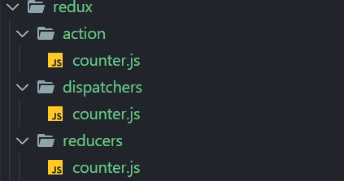

由于 vue2 采用的是 options API，导致我们在单个组件中容易组件组件臃肿的现象。
这里提供了一种可行的方法，将 methods 从组件中抽离出来。

## 示例1：一个简单的 Counter

下面将以一个简单的 Counter 为例，展示如何将 vue2 组件中的 methods 抽离。
```vue
// @/components/counter/index.vue
<template>
  <div class="counter">
    <counter-result :result="result"/>
    <div class="btns">
      <counter-button field="plus" innerText="+" @compute="compute" />
      <counter-button field="minus" innerText="-" @compute="compute" />
    </div>
  </div>
</template>

<script>
import CounterResult from './counter-result.vue'
import CounterButton from './counter-button.vue'
export default {
  name: 'Counter',
  components: {
    CounterResult,
    CounterButton
  },
  data() { return { result: 0 } },
  methods: {
    compute(action) {
      switch (action) {
        case 'plus':
          return this.result += 1;
        case 'minus':
          return this.result -= 1;
        default:
          break;
      }
    }
  }
}
</script>

// @/components/counter/counter-result.vue
<template>
  <div>
    <h1>当前计数为：{{ result }}</h1>
  </div>
</template>

<script>
export default {
  name: 'CounterResult',
  props: {
    result: Number,
  }
}
</script>

// @/components/counter/counter-button.vue
<template>
  <button @click="compute">{{ innerText }}</button>
</template>

<script>
export default {
  name: 'CounterButton',
  props: {
    innerText: String,
    field: String,
  },
  methods: {
    compute() {
      this.$emit('compute', this.field)
    }
  }
}
</script>

```

我们这里准备将 `@/components/counter/index.vue` 中的方法进行抽离，采用派发器的方式实现。

我们在 src 目录下创建一个 redux 的目录用于存放相关代码。


我们在 action 目录下存放我们要派发的任务类型。
reducers 目录则存放相关的处理逻辑。dispatchers 会根据
不同的 action 派发不同的处理逻辑。具体代码如下：
```javascript
// redux/action/counter.js
export const PLUS  = 'PLUS';
export const MINUS = 'MINUS';

// redux/reducers/counter.js
export default function counterReducer(data) {
  function plus() {
    data.result += 1;
  }
  
  function minus() {
    data.result -= 1;
  }
  return {
    plus,
    minus,
  }
}

// redux/dispatchers/counter.js
import { PLUS, MINUS } from '../action/counter'
import counterReducer from '../reducers/counter'

/**
 * @param { Record<string, any> } ctx
 */
export default (ctx) => {
  const { plus, minus } = counterReducer(ctx)
  return (action, ...args) => {
    switch (action) {
      case PLUS:
        return plus(...args)
      case MINUS:
        return minus(...args)
      default:
        break
    }
  }
}
```

接下来开始抽离 counter 中的 methods：
```vue
<template>
    <counter-button field="PLUS" innerText="+" @compute="dispatch" />
    <counter-button field="MINUS" innerText="-" @compute="dispatch" />
</template>
<script>
import dispatcher from '@/redux/dispatchers/counter';

  methods: {
    dispatch(action) {
      dispatcher(this.$data)(action);
    }
</script>
```

这里只展示了部分重要的逻辑，可以看到，抽离后的 methods 变得更为简单。需要注意的是 `dispatcher` 需要传入一个执行上下文，可以是 `this` 或者是 `this.$data`。利用 vue 为 data 中的每一个字段都定义了观察者，我们可以在其他文件中也实现响应式。

## 稍微复杂的计算器

```vue
// @/components/calculator/index.vue
<template>
  <div class="calculator">
    <calculator-result :result="result" />
    <div class="inputs">
      <calculator-input @setNumber="dispatch" field="firstNumber" />
      <calculator-input @setNumber="dispatch" field="secondNumber" />
    </div>
    <div class="btns" @click="handleBtnsClick">
      <calculator-button :class="{active: currentType === 'PLUS'}" type="PLUS" innerText="+" />
      <calculator-button :class="{active: currentType === 'MINUS'}" type="MINUS" innerText="-" />
      <calculator-button :class="{active: currentType === 'MUL'}" type="MUL" innerText="*" />
      <calculator-button :class="{active: currentType === 'DIV'}" type="DIV" innerText="/" />
    </div>
  </div>
</template>

<script>
import CalculatorResult from './calculator-result.vue'
import CalculatorInput from './calculator-input.vue'
import CalculatorButton from './calculator-button.vue'
import { SET_NUMBER, CHANGE_TYPE } from '@/redux/action/calculator'
import dispatcher from '@/redux/dispatchers/calculator'

export default {
  name: 'Calculator',
  components: {
    CalculatorResult,
    CalculatorButton,
    CalculatorInput,
  },
  data() {
    return {
      firstNumber: 0,
      secondNumber: 0,
      result: 0,
      currentType: 'PLUS'
    }
  },
  methods: {
    handleBtnsClick(e) {
      const { target } = e
      if (!target && target.tagName.toLowerCase() !== 'button') { return }
      const type = target.dataset.type
      if (this.currentType !== type) {
        // debugger
        this.dispatch(CHANGE_TYPE, type)
      }
    },

    dispatch(...args) {
      dispatcher(this)(...args)
    }
  },
}
</script>

<style lang="scss" scoped>
.active { background: orange; color: #fff; }
</style>

// @/components/calculator/calculator-input.vue
<template>
  <input type="text" v-model.number.trim="inputValue" @input="setNumber" />
</template>

<script>
import { SET_NUMBER } from '@/redux/action/calculator'
export default {
  name: 'CalculatorInput',
  props: {
    field: String,
  },
  data() {
    return {
      inputValue: 0,
    }
  },
  methods: {
    setNumber() {
      const value = typeof this.inputValue === 'number' ? this.inputValue : 0
      this.$emit('setNumber', SET_NUMBER, this.field, value)
    },
  },
}
</script>

// @/components/calculator/calculator-result.vue
<template>
  <h1>当前结果为：{{ result }}</h1>
</template>

<script>
export default {
  name: 'CalculatorResult',
  props: {
    result: Number,
  }
}
</script>

// @/components/calculator/calculator-button.vue
<template>
  <button :data-type="type">{{ innerText }}</button>
</template>

<script>
export default {
  name: 'CalculatorButton',
  props: {
    innerText: String,
    type: String
  },
}
</script>
```

抽离出来的逻辑如下：
```javascript
// @/redux/action/calculator.js
export const SET_NUMBER  = 'SET_NUMBER'
export const CHANGE_TYPE = 'CHANGE_TYPE'

// @/redux/reducers/calculator.js
import { compute } from '@/utils/compute'
export default data => {
  const setNumber = (field, value) => {
    data[field] = value
    return (data.result = compute(data.currentType, data.firstNumber, data.secondNumber))
  }

  const changeType = (type) => {
    data.currentType = type
    return (data.result = compute(data.currentType, data.firstNumber, data.secondNumber))
  }
  
  return {
    setNumber,
    changeType,
  }
}

// @/redux/dispatchers/calculator.js
import calculatorReducer from '../reducers/calculator'
import { SET_NUMBER, CHANGE_TYPE } from '../action/calculator'
export default (ctx) => {
  const { setNumber, changeType } = calculatorReducer(ctx)
  return (action, ...args) => {
    switch (action) {
      case SET_NUMBER:
        return setNumber(...args)
      case CHANGE_TYPE:
        return changeType(...args)
      default:
        break
    }
  }
}
```


## reference
