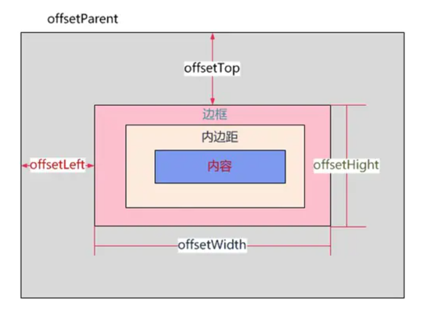
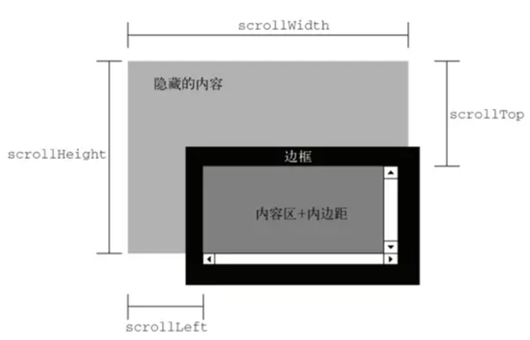

## 各种宽度

### offset



### client


### scroll




## BFC 规范

> BFC 全称 block formatting context。BFC 规定了一个独立块的渲染区域，

一个元素如果拥有 BFC，则我们可以把这个元素看成隔离的元素，容器内部的元素不会影响
到容器外部的元素。

常见的触发 BFC 的条件：
1. `html` 根元素。
2. 浮动元素。
3. 绝对顶位的元素。(`position` 为 `absolute` 或 `fixed`)
4. 行内块元素。
5. `display: flex / grid` 的元素。
6. `overflow` 不为 `visible` 的元素。

其他条件可以参考：[块格式化上下文](https://developer.mozilla.org/zh-CN/docs/Web/Guide/CSS/Block_formatting_context)

### BFC 解决的问题

#### 保持原有的外边距

考虑下面的例子：
```html
<head>
  <meta charset="UTF-8">
  <meta http-equiv="X-UA-Compatible" content="IE=edge">
  <meta name="viewport" content="width=, initial-scale=1.0">
  <title>bfc - application1</title>
  <style>
    .box1 {
      width: 200px;
      height: 200px;
      margin: 100px;
      background: lightgreen;
    }
    
    .box2 {
      width: 200px;
      height: 200px;
      margin: 100px;
      background: lightblue;
    }
  </style>
</head>

<body>
  <div class="box1"></div>
  <div class="box2"></div>
</body>

```

我们为两个盒子设置外边距为 `100px`，但是从实际的作用结果上看，
两个盒子之间的边距只有 `100px`，与我们预期的 `200px` 有点出入。
这种现象称之为**外边距塌陷**。这种异常并不是 bug，而是一种规范。
为了解决这种问题，我们只需要用到 BFC了。


我们将两个盒子分别放在两个满足 BFC 的 container 中，从结果上
看，两个盒子的上下边距就正常排布了。

```html
<style>
// ⬇⬇⬇⬇⬇⬇⬇⬇⬇⬇⬇⬇⬇⬇⬇⬇⬇⬇⬇⬇⬇
.container {
  overflow: hidden;
}
</style>

<body>
  // ⬇⬇⬇⬇⬇⬇⬇⬇⬇⬇⬇⬇⬇
  <div class="container">
    <div class="box1"></div>
  </div>
  // ⬇⬇⬇⬇⬇⬇⬇⬇⬇⬇⬇⬇⬇
  <div class="container">
    <div class="box2"></div>
  </div>
</body>
```


#### 解决盒子塌陷

```html

<style>
  .child {
    float: left;
    width: 100px;
    height: 100px;
    background: lightblue;
  }
  .parent {
    border: 1px solid red;
  }
</style>

<body>
  <div class="parent">
    <div class="child"></div>
  </div>
</body>
```

由于子元素设置为浮动，而父元素没有指定高度，
就会发生**盒子塌陷**问题。


解决这一问题的方案之一就是采用 BFC 盒子。具体的做法
就是在父容器上添加 css 属性，使其满足 BFC 规范即可。

```html
<style>
.parent {
  display: flex;
  border: 1px solid red;
}
</style>
```


我们这里采用 `display: flex;`  来触发 BFC，从结果上看，父元素塌陷的
问题完美解决。

#### 阻止元素被浮动元素覆盖

两个同级的盒子，如果其中一个盒子设置为浮动，另外一个盒子
并非浮动盒子，则浮动盒子会漂浮在没有浮动的盒子之上。
参考下面的代码：

```html
<style>
  .float-box {
    float: left;
    background: red;
    width: 100px;
    height: 100px;
  }
  
  .normal-box {
    width: 200px;
    height: 200px;
    background: lightgreen;
  }
</style>

<div class="float-box"></div>
<div class="normal-box"></div>
```


解决办法：让正常元素触发 BFC。

```html{6}
.normal-box {
  width: 200px;
  height: 200px;
  background: lightgreen;
  
  overflow: hidden;
}
```


## Reference

- [块格式化上下文](https://developer.mozilla.org/zh-CN/docs/Web/Guide/CSS/Block_formatting_context)