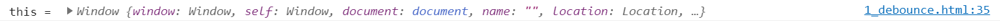
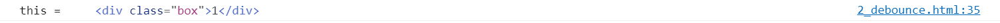

## 引例

```html
<!-- introduction.html -->
<head>
  <title>introduction to debounce</title>
  <style>
    .box {
      --height: 100px;
      width: 500px;
      height: var(--height);
      line-height: var(--height);
      background: black;
      color: white;
      margin: 100px auto;
      text-align: center;
    }
  </style>
</head>

<body>
  <div class="box">0</div>
  <script>
    const box = document.querySelector('.box')
    let count = 1
    function increment() {
      count++
      box.innerHTML = count
    }
    box.addEventListener('mousemove', increment)
  </script>
</body>
```


我们来看上面的一个例子：我们给`box`添加一个事件，当鼠标在`box`上移动时，就会触发该事件，修改`box`中`innerHTML`为`count`。
由于`mousemove`是一个高频事件，也就是说，当我们鼠标在上面移动时，`increment`会触发很多次。但是，如果浏览器不能在既定时间内完成该事件的多次触发，就会出现一种卡帧的现象。其次，有时候我们并不想`mousemove`触发那么高频，只要当用户停止移动鼠标时，才执行回调函数。

## 基本概念

> 防抖：事件触发后的 n 秒后才执行回调函数。如果在这 n 秒内，用户再一次触发该事件，则以最后一次触发该事件为基准，重新计算时间。

## 实现

从防抖的定义出发，我们可以知道，防抖需要用到一个定时器。下面我们先实现最简单的防抖函数。

### version1: 简单版的节流函数

```ts
function debounce(fn: Function, wait = 1000): Function {
  let timeout: number | null = null
  return function () {
    if (timeout !== null) {
      clearTimeout(timeout)
      timeout = null
    }
    timeout = setTimeout(fn, wait)
  }
}
```

防抖函数的核心代码为：

```ts
function debounce(fn) {
  return function () {}
}
```

接收一个待防抖的函数，返回已经实现防抖功能的函数。
还是最初的例子，我们来看具体的使用：

```ts
box.addEventListener('mousemove', debounce(increment))
```

这里的回调函数不将是最初的回调函数，而是经过我们防抖后的函数。

执行代码后，我们可以知道节流函数已经基本实现了：触发事件后，n 秒后执行回调函数，如果中间又重新触发事件，则重新计算时间。


但是，这里有个问题就是，我们防抖后的函数`this`指向问题，如果我们在最初的回调函数中打印`this`，来看会是什么结果：

```ts{4}
function increment() {
  count++
  box.innerHTML = count
  console.log('this = ', this)
}
```



this 指向`window`，这不是我们想要的，我们需要修改防抖后函数的`this`，以便得到我们想要的结果。

### version2: this 指向

```ts{8}
function debounce(fn: Function, wait = 1000): Function {
  let timeout: number | null = null
  return function () {
    if (timeout !== null) {
      clearTimeout(timeout)
      timeout = null
    }
    timeout = setTimeout(fn.bind(this), wait)
  }
}
```

我们只需要修改一下`setTimeout`的回调函数，为其绑定`this`即可。


完成`this`指向问题后，我们又遇到一个新的问题：如何传参。例如，在没有`debounce`的事件监听中，我们可以很容易拿到`event`对象的，例如：

```ts{5}
function increment(event) {
  count++
  box.innerHTML = count
  console.log('this = ', this)
  console.log('event = ', event)
}
```

但是我们的`debounce`似乎实现不了。下面我们就来实现`debounce`后函数传参问题。

### version3: 参入参数

```ts{3,8}
function debounce(fn: Function, wait = 1000): Function {
  let timeout: number | null = null
  return function (...args: any[]) {
    if (timeout !== null) {
      clearTimeout(timeout)
      timeout = null
    }
    timeout = setTimeout(fn.bind(this, ...args), wait)
  }
}
```

我们只需要修改返回的函数，让其接收参数，并在`bind`的同时，传入参数即可。

### version5: 立即执行

有时候，我们并不想回调函数在 n 秒后再执行，有时候我们想让回调函数先执行，然后 n 秒后不会再执行，接下来我们就来实现这个功能。

```ts{4,10-13,15}
function debounce(fn: Function, wait = 1000, immediate = true): Function {
  let timeout: number | null = null
  return function (...args: any[]) {
    let callNow = timeout === null
    if (timeout !== null) {
      clearTimeout(timeout)
      timeout = null
    }

    if (immediate) {
      timeout = setTimeout(() => (timeout = null), wait)
      if (callNow) fn.apply(this, args)
    } else {
      timeout = setTimeout(fn.bind(this, ...args), wait)
    }
  }
}
```

代码与之前有异曲同工之妙，如果不看高亮的部分，version5 与 version4 完全相同了。我们用`immediate = true`，用于标识立刻执行，如果`immediate = false`则就是之前的版本。同时，我们这里用`timeout === null`作为是否立刻执行的标志，
这里需要注意的是，我们在清除定时器之前先判断是否可以立刻执行`callNow = timeout === null`。通过`timeout = setTimeout(() => (timeout = null), wait)`来调节开关。

### version4: 返回值

对于`immediate = true`的防抖函数，事实上，我们可以拿到其放回值的。

```ts{5,14,19}
function debounce(fn: Function, wait = 1000, immediate = true): Function {
  let timeout: number | null = null
  return function (...args: any[]) {
    let callNow = timeout === null
    let result: any
    if (timeout !== null) {
      clearTimeout(timeout)
      timeout = null
    }

    if (immediate) {
      timeout = setTimeout(() => (timeout = null), wait)
      if (callNow) {
        result = fn.apply(this, args)
      }
    } else {
      timeout = setTimeout(fn.bind(this, ...args), wait)
    }
    return result
  }
}
```

### version6: 取消

有时候，我们并不需要一定等到 n 秒后才能执行，我们还想通过手动的方式来执行回调函数，这就涉及到取消防抖函数了，来看具体的实现：

```ts{22-25}
function debounce(fn: Function, wait = 1000, immediate = true): Function {
  let timeout: number | null = null
  function debouncedFn(...args: any[]) {
    let callNow = timeout === null
    let result: any
    if (timeout !== null) {
      clearTimeout(timeout)
      timeout = null
    }

    if (immediate) {
      timeout = setTimeout(() => (timeout = null), wait)
      if (callNow) {
        result = fn.apply(this, args)
      }
    } else {
      timeout = setTimeout(fn.bind(this, ...args), wait)
    }
    return result
  }

  debouncedFn.cancel = () => {
    clearTimeout(timeout)
    timeout = null
  }

  return debouncedFn
}
```

核心代码就是高亮部分，我们只需要将定时器清除，并设置`timeout = null`即可。

## 应用场景

对于一些高频的事件函数，通过防抖可以避免出现卡帧现象，场景的高频事件函数有：

- `window.resize`, `window.scroll`
- `mousemove`, `mousedown`
- `keyup`, `keydown`
- ...

## reference

- [JavaScript 专题之跟着 underscore 学防抖](https://github.com/mqyqingfeng/Blog/issues/22)
