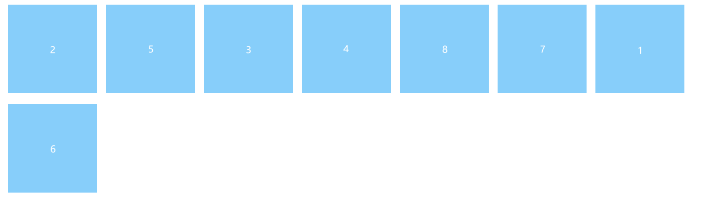

## 懒加载
### 写在前面

这里的图片懒加载指的是当图片滑动到可视区域内才进行加载。但是，这种加载是按照顺序执行的，
也就是如果用户一开始立马滑动到下方的话，当前视口上面的所有图片还是会被加载的。

### 实现原理

图片懒加载的实现原理：

1. 先使用一张默认的图片填充 img。
2. 将真正的 src 放在 `data-src` 里面。
3. 当滚动窗口滚动到当前图片的位置时，将 `img.src = img.dataset['src']`。
4. 完成后删除 `img.dataset['src']`。

img 的模板标签如下：

```html

```
### 判断元素是否在可视区

判断图片是否进入可视区可以采用如下代码：

```javascript
/**
 * 判断元素是否在可视区范围。
 * @param { HTMLElement } el 待判断的元素节点。
 * @param { HTMLElement } parent 顶层的滚动元素
 * @returns { boolean } true 如果 el 在可视区范围，否则 false
 */
export function isInVisibleArea(el, parent) {
function isInVisibleArea(el, parent) {
  const cHeight = parent.clientHeight;
  const sTop = parent.scrollTop;
  const oTop = el.offsetTop;
  return oTop < cHeight + sTop;
}
```

### 实现懒加载

先来看我们的模板：
```html
<ul class="img-list">
</ul>
<template>
  <li class="img-item">
    
  </li>
</template>
```

### 另一种方式

现代浏览器为我们提供了判断元素是否在可视化视口内的 API，
根据这个 API 我们可以很容易实现图片懒加载：

```javascript
const data = [
  { src: 'images/1.png', name: 'pic1' },
  { src: 'images/2.png', name: 'pic2' },
  { src: 'images/3.png', name: 'pic3' },
  { src: 'images/4.png', name: 'pic4' },
  { src: 'images/5.png', name: 'pic5' },
  { src: 'images/6.png', name: 'pic6' },
  { src: 'images/7.png', name: 'pic7' },
  { src: 'images/8.png', name: 'pic8' }
]

const template = document.getElementsByTagName('template')[0].innerHTML
const container = document.querySelector('.img-list')
const imgListStr = render(data, template)
container.innerHTML = imgListStr
const images = container.querySelectorAll('img')

let count = 0
const length = images.length
const io = new IntersectionObserver((entries) => {
  entries.forEach((entry) => {
    const target = entry.target
    if (entry.intersectionRatio > 0) {
      target.src = target.getAttribute('data-src')
      target.removeAttribute('data-src')
      io.unobserve(target)
      if (++count === length) {
        io.disconnect()
      }
    }
  })
})

images.forEach((item) => {
  io.observe(item)
})

function render(data, template) {
  let imgStr
  const imgStrArr = []
  data.forEach((item) => {
    imgStr = template.replace(/{{(.*?)}}/g, function (_, key) {
      return {
        src: item['src'],
        name: item['name']
      }[key]
    })
    imgStrArr.push(imgStr)
  })
  return imgStrArr.join('')
}
```

我们定义了一个 `img-list` 的容器，用于存放图片，
我们将 `template` 中的代码作为我们的模板 html。
其中，`./images/pad.png` 是一张背景图片，相当于骨架图。

下面是我们从后端获取过来的数据：
```javascript
const data = [
  { src: 'images/1.png', name: 'pic1'},
  { src: 'images/2.png', name: 'pic2'},
  { src: 'images/3.png', name: 'pic3'},
  { src: 'images/4.png', name: 'pic4'},
  { src: 'images/5.png', name: 'pic5'},
  { src: 'images/6.png', name: 'pic6'},
  { src: 'images/7.png', name: 'pic7'},
  { src: 'images/8.png', name: 'pic8'},

];
```

获取完数据后，我们将数据渲染到模板上。

```javascript
const template = document.getElementsByTagName('template')[0].innerHTML;
const container = document.querySelector('.img-list');
const imgListStr = render(data, template);
container.innerHTML = imgListStr;

function render(data, template) {
  let imgStr;
  const imgStrArr = [];
  data.forEach(item => {
    imgStr = template.replace(/{{(.*?)}}/g, function (_, key) {
      return {
        src: item['src'],
        name: item['name'],
      }[key]
    })
    imgStrArr.push(imgStr);
  })
  return imgStrArr.join('');
}
```

其次，我们还需要绑定一个 `scroll` 事件，同时当 `window.onload` 的时候，我们也应该
加载一部分图片：
```typescript
function bindEvent() {
  const images = document.querySelectorAll('.img-item img');

  window.onload = window.onscroll = throttle(lazyLoad(images));
}
```

再解释为什么要使用节流函数之前，我们先来看一下 `lazyLoad` 的实现：
```javascript
function lazyLoad(images) {
  const length = images.length;
  const doc = document;
  let n = 0;

  return function () {
    const cHeight = doc.documentElement.clientHeight;
    const scrollTop = doc.documentElement.scrollTop || doc.body.scrollTop;
    let img;
    for (let i = n; i < length; i++) {
      img = images[i];
      if (img.offsetTop < cHeight + scrollTop) {
        loadImage(img);
        ++n;
      }
    }
  }
}
```

这里采用了闭包的实现方式主要是为了缓存变量。其中，判断元素是否可视区范围
内我们上面已经讲过了。值得注意的是，我们这里声明了变量 `n` 用于记录当前已经加载
完成的图片的数量。

再来看 `loadImage` 的实现：
```javascript
function loadImage(img) {
  if (!img || !img instanceof HTMLImageElement) throw new TypeError(`${img} is not a HTMLImageElement`);
  img.src = img.getAttribute('data-src') || '';
  img.removeAttribute('data-src');
}
```

像我们之前说的，加载图片的过程就是获取 `img.dataset['src']` 后，赋值给 `img.src`，
最后再把 `img.dataset['src']` 删除。

最后，再来回答我们为什么要使用节流函数了。主要还是 `scroll` 触发太快的缘故，这就是节流
函数的使用初衷。

## 图片预加载
图片预加载指的是在图片打开前将图片加载到用户本地，当需要时再进行渲染。

图片预加载有两种方式：
1. 无序加载。
2. 有序加载。

其核心是通过 javascript 提供的 `Image` 对象实现的。

### 无序加载

```javascript
const container = document.querySelector('.container')
const data = [
  { src: 'images/1.png', name: 'pic1' },
  { src: 'images/2.png', name: 'pic2' },
  { src: 'images/3.png', name: 'pic3' },
  { src: 'images/4.png', name: 'pic4' },
  { src: 'images/5.png', name: 'pic5' },
  { src: '', name: 'pic6' }, // 测试异常图片
  { src: 'images/6.png', name: 'pic6' },
  { src: 'images/7.png', name: 'pic7' },
  { src: 'images/8.png', name: 'pic8' }
]

const length = data.length
const imgList = mapImage(data.map((item) => item.src)).then((imageList) =>
  addChildren(imageList, container)
)

function loadImage(src) {
  return new Promise((resolve, reject) => {
    const img = new Image()
    img.src = src
    img.onload = () => resolve(img)
    img.onerror = reject
  })
}

function mapImage(images) {
  return new Promise((resolve) => {
    const list = []
    const length = images.length
    let count = 0
    for (let i = 0; i < length; i++) {
      const image = images[i]
      loadImage(image)
        .then((img) => {
          list.push(img)
          count++
          if (count === length) resolve(list)
        })
        .catch((_) => {
          count++
          if (count === length) resolve(list)
        })
    }
  })
}

function addChildren(children, parent) {
  try {
    parent.append(...children)
  } catch (_) {}
}
```

为了更好地看出是无序加载，我们可以修改一下 `loadImage` 的代码：
```javascript
function loadImage(src) {
  return new Promise((resolve, reject) => {
    const time = Math.random() * 1000
    const img = new Image()
    img.src = src
    img.onload = () => resolve(img)
    img.onload = () => {
      setTimeout(() => resolve(img), time)
    }
    img.onerror = reject
  })
}
```



### 有序加载

```javascript
const container = document.querySelector('.container')
const data = [
  { src: 'images/1.png', name: 'pic1' },
  { src: 'images/2.png', name: 'pic2' },
  { src: 'images/3.png', name: 'pic3' },
  { src: 'images/4.png', name: 'pic4' },
  { src: 'images/5.png', name: 'pic5' },
  { src: 'images/6.png', name: 'pic6' },
  { src: 'images/7.png', name: 'pic7' },
  { src: 'images/8.png', name: 'pic8' }
]

const length = data.length
const imgPromiseList = loadImages(data.map((item) => item.src))
Promise.all(imgPromiseList)
  .then((images) => {
    addChildren(images, container)
  })
  .catch((e) => console.log(e))

function loadImage(src) {
  return new Promise((resolve, reject) => {
    const time = Math.random() * 1000
    const img = new Image()
    if (!src) reject('invalid src')
    img.src = src
    img.onload = () => {
      setTimeout(() => resolve(img), time)
    }
    img.onerror = reject
  })
}

function loadImages(imgUrlList) {
  return imgUrlList.map((item) => {
    return loadImage(item)
  })
}

function addChildren(children, parent) {
  try {
    parent.append(...children)
  } catch (_) {}
}
```

这里使用 `Promise.all` 将所有的 `Promise` `resolve` 掉，
但问题在于，如果其中一个 `Promise` 被 `rejected` 的话，那么
我们就拿不到已经加载完成的图片了。

下面对此进行优化，
这里主要是修改 `Promise.all` 的代码即可：
```javascript
// ...
const length = data.length
const imgPromiseList = loadImages(data.map((item) => item.src))
const images = ensureOrder(imgPromiseList)
  .then((images) => addChildren(images.filter(item => item !== null), container))
  .catch((e) => console.log(e))

function ensureOrder(promises) {
  return new Promise((resolve) => {
    const length = promises.length
    let count = 0
    const list = Array(length)
    promises.forEach((promise, index) => {
      // debugger
      promise
        .then((value) => {
          console.log(count, value)
          list[index] = value
          ++count === length && resolve(list)
        })
        .catch((_) => {
          list[index] = null
          ++count === length && resolve(list)
        })
    })
  })
}
```
