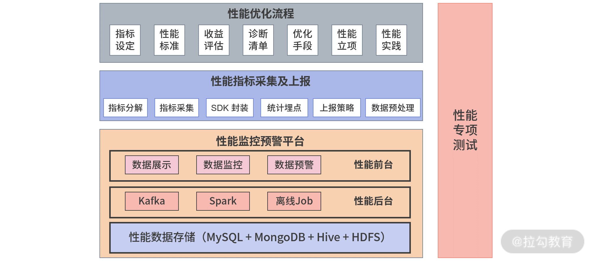

基于 [前端性能优化方法与实战](https://kaiwu.lagou.com/course/courseInfo.htm?courseId=638&sid=20-h5Url-0&lgec_type=website&lgec_sign=86228E00A960E2EB44DCA4027393428B&buyFrom=2&pageId=1pz4#/detail/pc?id=6538) 的小结和实践。

- [ 性能优化 - 性能优化方法论 - 优化体系及关键指标的设定 ](./1_1-perform-methods.md)
