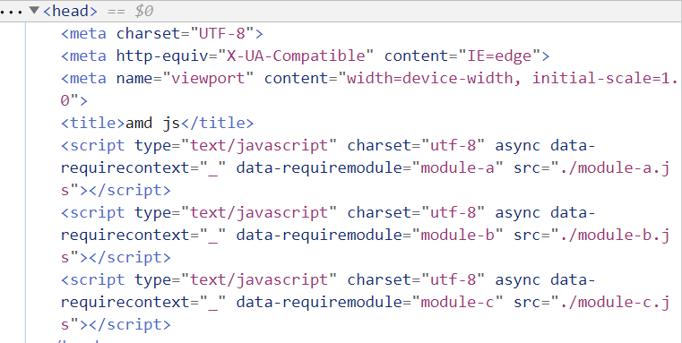
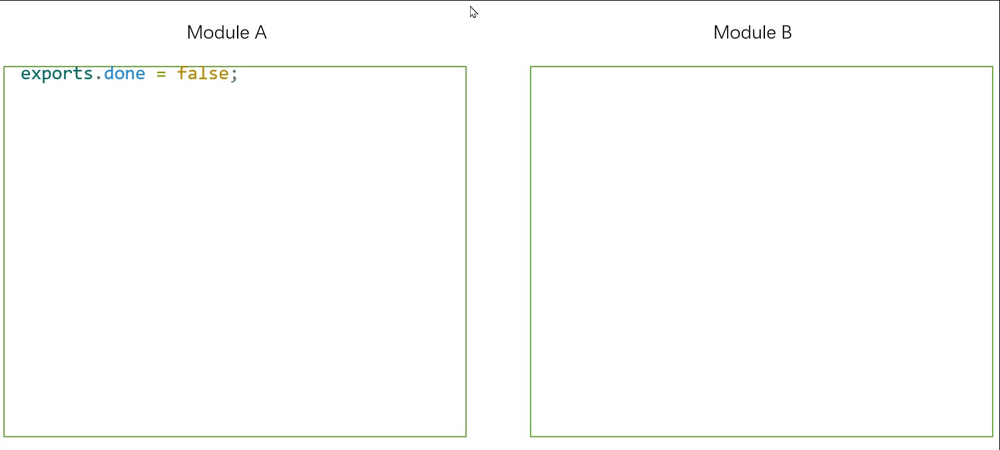

前端模块化要解决哪些问题？

## 发展历程

在早期的前端开发中，并没有模块化的概念。
甚至在 IE6 以前，浏览器还没有 js 引擎，
早期的 js 文件非常简单，一般通过 `script` 直接引入
或者直接在 `script` 标签中直接编写 js 代码，也就是采用
单文件进行管理 js 代码。

随着互联网的发展，前端业务逐渐变得复杂，使用 js 的情景越来越多，
业务量的增长也让 js 的代码量水涨船高，此时，还采用单个文件来维护
js 代码的话，一来不方便维护，同时用户请求的时间也随之变长了。再者，
采用单文件的方式不利于代码的复用。

于是，就有了一种新的文件管理方式，就是不同的页面对应不同的 js 文件，
即，以页面为基准将 js 代码划分为不同的脚本块。这是早期的模块化思维。

为了实现代码的复用，于是就出现了把公共的代码放在同一个文件中，
不同的页面按需引用。但是，这种做法也有一点问题，考虑下面的代码：

```javascript
// common1
function func1() {}
function func2() {}
```

作为公共的脚本，不同页面可以引用改文件。但是问题在于如果 A 页面
**只需要**用到改公共脚本中的 `func1`，这种引用发生或导致 A 页面
导入许多无用的东西，这显然不合理。也就是说，采用**以页面为基准**的
引用方式存在不足了。

于是就有了以程序为基准的脚本划分方式。

## 模块化初探

我们把一个程序划分为多个模块（模块 A，模块 B，和模块 C）进行管理。

```javascript
// ./module-a.js
var a = [1, 2, 3, 4]

// ./module-b.js
var b = {
  name: 'module b',
}

// ./module-c.js
var c = a.map(item => item * item)

// ./main.js
console.log(`a = ${JSON.stringify(a)}`)
console.log(`b = ${JSON.stringify(b)}`)
console.log(`c = ${JSON.stringify(c)}`)
```

```html
<!-- index.html -->
<script src="./module-a.js"></script>
<script src="./module-b.js"></script>
<script src="./module-c.js"></script>
<script src="./main.js"></script>
```

我们“定义”了三个模块，然后在 `main.js` 使用了这些模块。
其次，模块与模块之间存在引用，即 `module-c.js` 引用了 `module-a.js`。
然后，我们还需要在相应页面 `index.html` 中导入主程序。

这种模块化的方式也是很有问题的，一来由于变量是定义在全局作用域上，
污染了全局作用域。再者是这种模块化没能解决模块之间的依赖问题。
也就是，我们根本不知道当前模块引用了哪些其他模块（例如：在 `module-c` 中，
我们引用了 `module-a`，但单从代码上看我们根本不得而知）。同时，当我们
使用模块的时候，我们还需要按照模块引用的顺序对模块进行导入，如果顺序不对
会导致整个程序运行奔溃（例如：我们在 `index.html` 中现导入 `main.js` 再
导入其他模块，显然程序会奔溃）。

回到最初的问题：模块化究竟要解决什么问题？这里可以给出答案。
模块化需要解决：

1. 全局污染。
2. 模块污染。

为了解决上述的两个问题，引入了闭包来实现模块化。

利用闭包延长函数的作用域的同时，我们可以解决全局污染的问题。

```javascript
// ./module-a.js
var moduleA = (function () {
  var a = [1, 2, 3, 4]

  return {
    a: a,
  }
})()

// ./module-b.js
var moduleB = (function () {
  var b = {
    name: 'module b',
  }

  return {
    b: b,
  }
})()

// ./module-c.js
var moduleC = (function () {
  var c = moduleA.a.map(item => item * item)
  return {
    c: c,
  }
})()

// ./main.js
var a = moduleA.a
var b = moduleB.b
var c = moduleC.c

console.log(`module closure a = ${JSON.stringify(a)}`)
console.log(`module closure b = ${JSON.stringify(b)}`)
console.log(`module closure c = ${JSON.stringify(c)}`)
```

虽然我们解决了避免全局污染的问题，还有一个模块之间的相互依赖
还没有解决，下面就来解决这个问题。我们的程序中，只有 `module-c` 和
主程序引用
其他模块，我们对这两个文件进行修改。

```javascript
// ./module-c.js
var moduleC = (function (moduleA) {
  var c = moduleA.a.map(item => item * item)
  return {
    c: c,
  }
})(moduleA)

// ./main.js
;(function (moduleA, moduleB, moduleC) {
  var a = moduleA.a
  var b = moduleB.b
  var c = moduleC.c

  console.log(`module closure a = ${JSON.stringify(a)}`)
  console.log(`module closure b = ${JSON.stringify(b)}`)
  console.log(`module closure c = ${JSON.stringify(c)}`)
})(moduleA, moduleB, moduleC)
```

我们采用模块注入的方式，将模块 A 注入到模块 C 中，从而实现模块之间的依赖关系。

## commonJS

nodejs 中提供 `require` 和 `module.exports` 进行模块化管理。

但是，nodejs 提供的模块化管理方式只能运行在 node 环境上，想要运行
在浏览器上的话，还需要 webpack 提供支持。

commonJS 所提供的模块化管理方式具有如下特点：

1. 同步进行。
2. 只要引用就进行实例化。
3. 缓存模块。每引用一个模块就对引用的模块进行缓存。

## AMD (Asynchronous Module Definition)

之所以会有 AMD，是因为 commonJS 需要在 node 环境上才能运行。
AMD 的出现就是为了可以在浏览器上直接使用类似于 `require` 的模块化
管理方式。

与 commonJS 的模块化不同，AMD 采用的是异步模块的管理方式。
其使用方法如下：

1. 先引入 `require.js`。AMD 需要借助 `require.js` 实现。
2. 定义模块和使用模块。

   ```javascript
   // 定义模块。
   define('moduleName', ['dependency1', 'dependency2', ...], function factory() {});

   // 使用模块。
   require(['dependency1', 'dependency2', ...], function (inject1, inject2, ...) {})
   ```

还是用刚才的示例，不过这次我们使用 AMD 实现。

```javascript
// ./module-a.js
define('module-a', function () {
  var a = [1, 2, 3, 4, 5]
  return {
    a: a,
  }
})

// ./module-b.js
define('module-b', function () {
  var b = {
    name: 'module b',
  }
  return {
    b: b,
  }
})

// ./module-c.js
define('module-c', ['module-a'], function (moduleA) {
  var c = moduleA.a.map(function (item) {
    return item * item
  })
  return {
    c: c,
  }
})

// ./main.js
require(['module-a', 'module-b', 'module-c'], function (
  moduleA,
  moduleB,
  moduleC,
) {
  var a = moduleA.a
  var b = moduleB.b
  var c = moduleC.c
  console.log(`commonjs a = ${JSON.stringify(a)}`)
  console.log(`commonjs b = ${JSON.stringify(b)}`)
  console.log(`commonjs c = ${JSON.stringify(c)}`)
})
```

```html
<script src="./require.js"></script>
<script src="./main.js"></script>
```

同时，`require` 也提供了自定义模块路径的方式。具体使用方法如下：
`require.config({paths: { moduleName: 'modulePath' }})`

通过 commonJS 和 amd 的模块化管理方式，我们可以解决模块之间的相互依赖
关系的管理，所以，在 `index.html` 中，我们只需要引入 `main.js` 而不需要
在引用其他 js 文文件。模块之间的相互依赖关系由它们帮我们进行管理。

amd 采用的是异步加载的方式，而且在使用模块时先将依赖到的模块进行加载，
加载完成后才会执行回调函数（这种方式也叫**前置依赖**）。来看通过 amd 使用模块后的 html 代码：


可以看到，amd 会在 `head` 中先加载依赖，而且是采用 `async` 的方式进行加载的。
通过回调函数的方式，保证了异步加载模块的顺序问题。

## CMD (Common Module Definition)

CMD 的实现需要借助 `sea.js`。
其特点是：

1. 依赖就近。
2. 按需加载。

使用方式如下：

```javascript
// 1. 定义。
define(function (require, exports, module) {})
// 2. 使用
seajs.use(['modulePath'], function (moduleA, moduleB, moduleC) {})
```

## es6 模块化

ECMA 在 es6 中正式给出了 js 模块化的管理。
通过采用 `import` 和 `export` 的方式来实现模块的导入
与导出。只要 js 文件中使用到了 `import` 和 `export`，
我们就可以认为这是一个模块。

下面让我们将之前的示例用 es6 提供的模块化重新编写一下。

```javascript
// ./module-a.js
var a = [1, 2, 3, 4, 5]

export { a }

// ./module-b.js
var a = [1, 2, 3, 4, 5]

export { a }

// ./module-c.js
import { a } from './module-a.js'
var c = a.map(function (item) {
  return item * item
})

export { c }
```

使用 es6 进行模块管理还需要浏览器支持，所以在引用时，
需要指明改文件类型为 `module`。

```html
<script src="./main.js" type="module"></script>
```

可以看到 es6 给我们提供的模块化管理，实现起来其代码是
非常简洁的。

## es6 模块化与 commonJS 的区别

1. commonJS 模块输出的是一个值拷贝（值得注意的是，这种拷贝是浅拷贝），
   而 es6 模块输出的是值的引用。
2. commonJS 是运行时加载，而 es6 是编译输出接口。

要想解释第一点，我们来考虑如下的代码：

```javascript
// common js 实现模块化
// ./commonjs-module-a.js
var a = 0

setTimeout(() => {
  a++
}, 0)

module.exports = {
  a,
}

// commonjs-main.js
var moduleA = require('./commonjs-module-a')

setTimeout(() => {
  console.log('commonjs a = ', moduleA.a) // commonjs a = 0
}, 1000)

// es6 实现模块化
// ./es6-module-a.js
var a = 0

setTimeout(() => {
  a++
}, 0)

export { a }

import { a } from './es6-module-a.js'

setTimeout(() => {
  console.log('es6 a = ', a) // es6 a = 1;
}, 1000)
```

通过输出可以验证，es6 和 commonJS 的对模块的定义是不同的。

对于第二点，是因为 commonJS 加载的模块是一个对象，对象
只有在脚本运行完成后才会生成。而 es6 模块并不是对象，它只是
对外提供一种静态的定义，在代码的编译解析阶段就生成

## es6 与 commonJS 处理循环引用

### commonJS

在 commonJS 中，每一个模块就是一个实例。 cjs 会在
实例化模块的时候，设置一个标识位 `loaded = false`，
当模块加载完成后，`loaded = true`。

如果在后面加载过程中，引用到别的模块，cjs 引擎会去加载
引用的模块。如果遇到循环引用的时候，cjs 会忽略改模块的
加载，继续执行当前模块。所以，在 cjs 中如果遇到循环引用
的时候，我们只能拿到 前一个模块已经加载完成的数据。
来看下面的代码：

```javascript
// ./cjs-module-a.js
exports.done = false

var b = require('./cjs-module-b')
// moduleA: b.done =  true
console.log('moduleA: b.done = ', b.done)

exports.done = true
// moduleA: module has been loaded, loaded =  true
console.log('moduleA: module has been loaded, loaded = ', exports.done)

// ./cjs-module-b.js
exports.done = false

var a = require('./cjs-module-a')
// moduleB: a.done =  false
console.log('moduleB: a.done = ', a.done)

exports.done = true
// moduleB: module has been loaded, loaded =  true
console.log('moduleB: module has been loaded, loaded = ', exports.done)

// ./cjs-main.js
var a = require('./cjs-module-a')
var b = require('./cjs-module-b')

console.log('main: a.done = ', a.done)
console.log('main: b.done = ', b.done)
```



从动画我们可以理解 cjs 对模块的加载方式。
首先，加载 `module-a`，遇到 `require('module-b')` 时，
加载 `module-b`。
加载 `module-b` 时，又引用了 `require('module-a')`，
也就是循环引用了，
这时候 `cjs` 引擎不会再去加载 `module-a`，但是，在 `module-b`
中我们可以使用到 `module-a` 中已经加载的部分，这就是为什么
打印出 `moduleB: a.done = false`。加载完 `module-b` 后，
继续加载 `module-a`，所以输出 `moduleA: b.done = true`。

### es6

es6 的加载过程与 cjs 类似，但是由于 es6 的模块化采用的是
数据的引用方式，所以确保了数据是最新的，但这样作也可能带来
一定的坏处，也就在循环引用的时候会出现引用错误。
来看下面的代码：

```javascript
// ./module-a.js
import { done as BDone } from './es6-module-b.js'
console.log('moduleA: start loading...')

export let done = false
done = true
console.log('moduleA: moduleA.done = ', done)
console.log('moduleA: moduleB.done = ', BDone)

// ./module-a.js
import { done as ADone } from './es6-module-a.js'
export let done = false

console.log('moduleB: start loading...')
// Uncaught ReferenceError: Cannot access 'ADone' before initialization
console.log('moduleB: ADone = ', ADone)

done = true
console.log('moduleB: b.done = ', done)
```

上面代码执行时会抛出一个 `ReferenceError`，这是因为
`module-b` 中在执行的过程中，`module-a` 还没有声明
变量 `done`，这就就像 ts 中的接口，我们知道有这个值
的存在，但是，这个值是否定义了还得看具体的运行环境。

我们可以将变量该换成函数的方式来解决这个问题。
这是因为函数具有提升作用，也就是在 `module-a` 中
的 `import {} from './module-b.js` 执行之前，
改函数就定义好了。

```javascript
// ./module-a.js
import { done as BDone } from './es6-module-b.js'
console.log('moduleA: start loading...')

// export let done = false;
export function done() {
  return false
}
// done = true;
console.log('moduleA: moduleA.done = ', done())
console.log('moduleA: moduleB.done = ', BDone)

// ./module-b.js
import { done as ADone } from './es6-module-a.js'
export let done = false

console.log('moduleB: start loading...')
console.log('moduleB: ADone = ', ADone())

done = true
console.log('moduleB: b.done = ', done)
```

同样的道理，我们也不能使用箭头函数，因为箭头函数也不具备
变量提升的作用。
