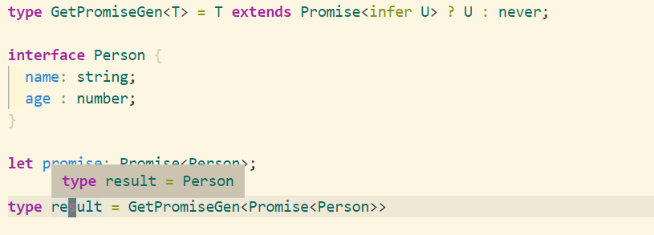

## 提取 promise 中的类型。

```typescript
type GetPromiseGen<T> = T extends Promise<infer U> ? U : never

interface Person {
  name: string
  age: number
}

let promise: Promise<Person>

type result = GetPromiseGen<Promise<Person>>
```


